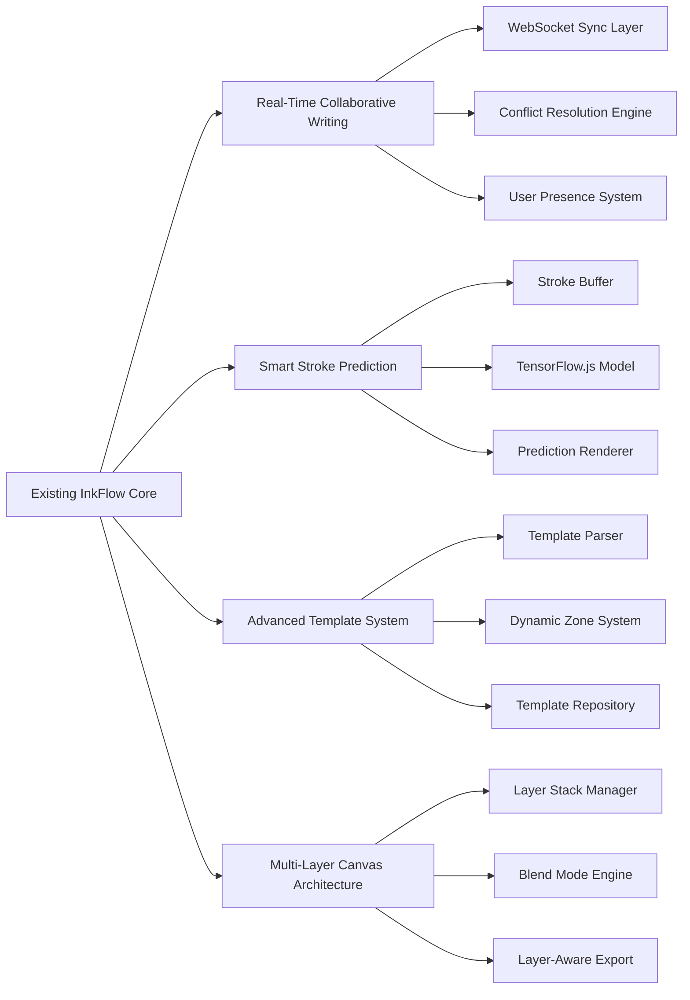
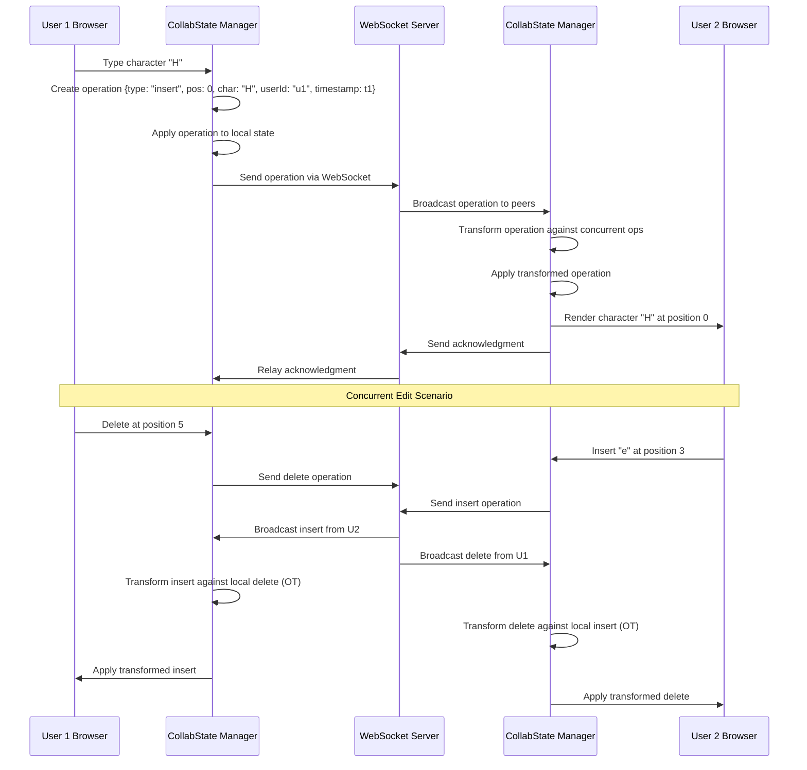
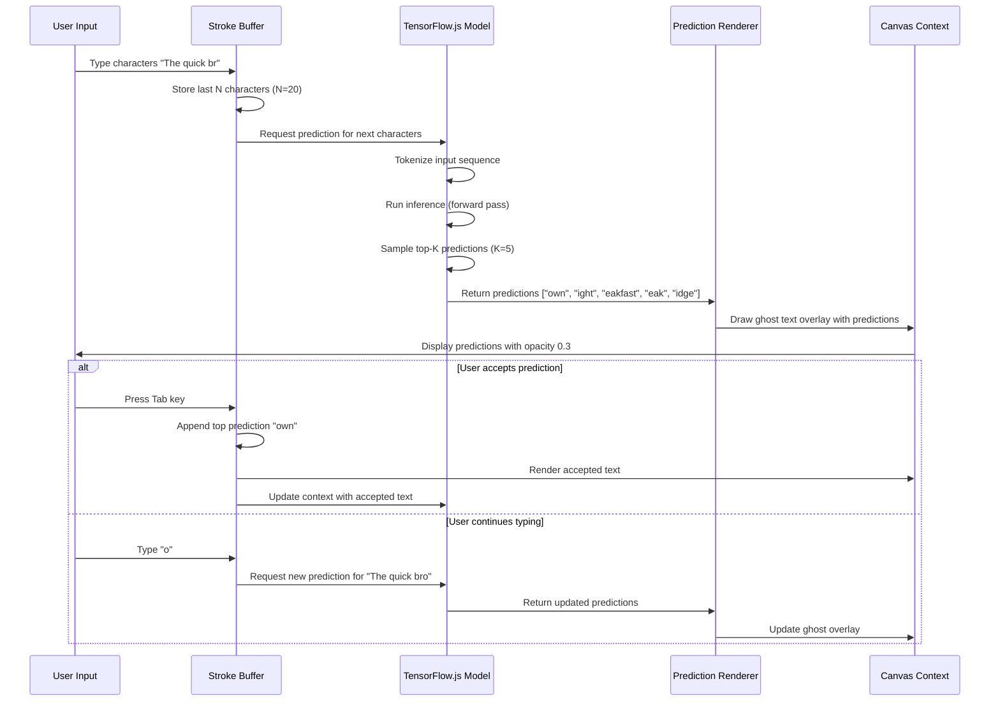
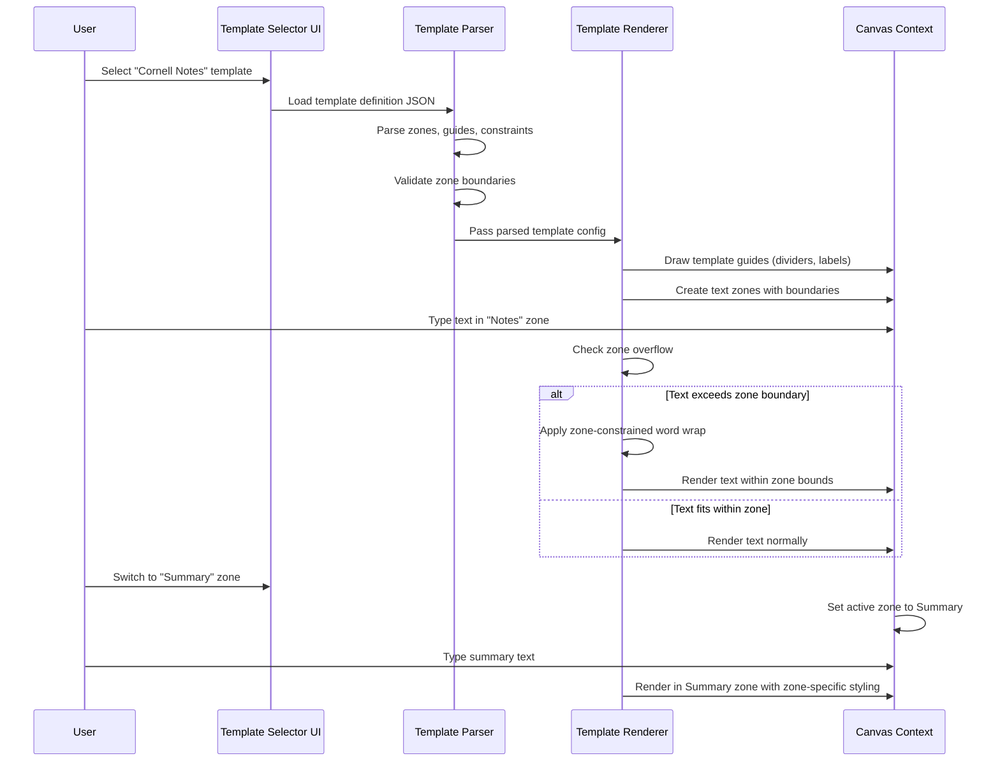
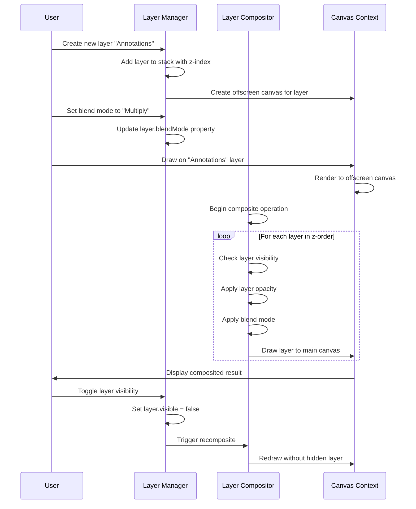

# Design Document: Advanced InkFlow Features

## Overview

This design introduces four advanced feature enhancements to the InkFlow handwriting application: **Real-Time Collaborative Writing**, **Smart Stroke Prediction**, **Advanced Template System**, and **Multi-Layer Canvas Architecture**. These features extend InkFlow's capabilities to support collaborative workflows, predictive handwriting assistance, flexible document templates, and sophisticated layer-based composition while maintaining the existing architecture's modularity and performance characteristics.

The design leverages InkFlow's existing unified layout engine (`layoutText`), animation system, state management, and export pipelines while introducing new subsystems for real-time synchronization, machine learning inference, template management, and layer composition.

## Architecture

### High-Level System Architecture

```mermaid
graph TD
    subgraph UI_Layer [User Interface Layer - Extended]
        A[Control Console / Sidebar]
        B[Floating Top Toolbar]
        C[Canvas Viewport + Page Editors]
        D[Floating Pagination Controls]
        E[NEW: Collaboration Panel]
        F[NEW: Template Selector]
        G[NEW: Layer Manager]
        H[NEW: Stroke Predictor HUD]
    end

    subgraph State_Layer [State Management Layer - Extended]
        I[Global State Object S]
        J[Debounced Autosave Module]
        K[LocalStorage Interface]
        L[IndexedDB Glyph Store]
        M[NEW: CollabState Manager]
        N[NEW: LayerState Manager]
        O[NEW: TemplateState Manager]
    end

    subgraph Engine_Layer [Core Execution Engines - Extended]
        P[Paper Renderer]
        Q[Glyph Variation Engine]
        R[layoutText - Unified Layout Engine]
        S[Writing Queue & Animation Engine]
        T[Page Editor Sync Layer]
        U[NEW: Collaborative Sync Engine]
        V[NEW: Stroke Prediction Engine]
        W[NEW: Template Renderer]
        X[NEW: Layer Compositor]
    end

    subgraph External_Layer [Integration & Export Services - Extended]
        Y[OpenRouter / Anthropic Claude API]
        Z[Blob URL Export]
        AA[jsPDF Multi-Page Compiler]
        AB[Clipboard API]
        AC[OS Print Spooler]
        AD[NEW: WebSocket Server]
        AE[NEW: ML Model Service - TensorFlow.js]
        AF[NEW: Template Repository API]
    end

    A -->|User Input Events| I
    E -->|Collab Actions| M
    F -->|Template Selection| O
    G -->|Layer Operations| N
    H -->|Prediction Events| I
    
    I -->|State Sync| J
    M -->|Real-time Updates| U
    N -->|Layer Composition Triggers| X
    O -->|Template Load| W
    
    J -->|Serialized Save| K
    L -->|Glyph Data Hydration| I
    
    U -->|WebSocket Messages| AD
    V -->|ML Inference| AE
    W -->|Template Fetch| AF
    
    R -->|Char Queue + Page Texts| S
    R -->|Layout Data| X
    X -->|Composited Canvas| C
    U -->|Remote Changes| T
    V -->|Predicted Strokes| Q
```



### Feature Architecture Integration



## Sequence Diagrams

### Real-Time Collaborative Writing Flow



### Smart Stroke Prediction Flow



### Template System Flow



### Multi-Layer Canvas Flow



## Components and Interfaces

### Component 1: Collaborative Sync Engine

**Purpose**: Manages real-time synchronization of document changes across multiple connected clients using Operational Transformation (OT) for conflict resolution.

**Interface**:
```pascal
INTERFACE CollaborativeEngine
  PROCEDURE initialize(documentId, userId, websocketUrl)
  PROCEDURE connect()
  PROCEDURE disconnect()
  PROCEDURE sendOperation(operation)
  PROCEDURE receiveOperation(operation)
  PROCEDURE transformOperation(localOp, remoteOp)
  PROCEDURE applyOperation(operation)
  PROCEDURE getDocumentState()
  PROCEDURE getUserPresence()
END INTERFACE
```

**Responsibilities**:
- Establish and maintain WebSocket connection to collaboration server
- Serialize local text operations into operational transform messages
- Transform incoming remote operations against pending local operations
- Apply transformed operations to maintain consistency
- Track cursor positions and user presence indicators
- Handle connection recovery and state reconciliation

### Component 2: Stroke Prediction Engine

**Purpose**: Provides real-time text prediction using a trained neural language model to suggest likely continuations of the current writing context.

**Interface**:
```pascal
INTERFACE StrokePredictionEngine
  PROCEDURE initialize(modelPath, vocabSize, embeddingDim)
  PROCEDURE loadModel()
  PROCEDURE predict(contextText, topK)
  PROCEDURE updateContext(newText)
  PROCEDURE acceptPrediction(predictionIndex)
  PROCEDURE getConfidenceScore(prediction)
  PROCEDURE setTemperature(temperature)
END INTERFACE
```

**Responsibilities**:
- Load and initialize TensorFlow.js language model
- Maintain rolling context buffer of recent characters
- Tokenize input text using byte-pair encoding vocabulary
- Run inference to generate top-K predictions
- Calculate confidence scores for predictions
- Manage temperature parameter for sampling diversity
- Update model state when predictions are accepted

### Component 3: Template Manager

**Purpose**: Loads, parses, and manages document templates with dynamic zones, guides, and layout constraints.

**Interface**:
```pascal
INTERFACE TemplateManager
  PROCEDURE loadTemplate(templateId)
  PROCEDURE parseTemplate(templateJson)
  PROCEDURE getZones()
  PROCEDURE getActiveZone()
  PROCEDURE setActiveZone(zoneId)
  PROCEDURE validateZoneContent(zoneId, text)
  PROCEDURE renderTemplateGuides(canvasContext)
  PROCEDURE saveCustomTemplate(templateConfig)
END INTERFACE
```

**Responsibilities**:
- Fetch template definitions from repository or local storage
- Parse template JSON to extract zones, guides, and constraints
- Validate zone boundaries and configuration
- Render static template elements (dividers, labels, backgrounds)
- Enforce text flow constraints within zone boundaries
- Support custom template creation and persistence

### Component 4: Layer Compositor

**Purpose**: Manages a stack of independent canvas layers with blend modes, opacity, and visibility controls for sophisticated composition.

**Interface**:
```pascal
INTERFACE LayerCompositor
  PROCEDURE createLayer(name, zIndex)
  PROCEDURE deleteLayer(layerId)
  PROCEDURE setLayerProperty(layerId, property, value)
  PROCEDURE reorderLayers(layerId, newZIndex)
  PROCEDURE getLayerCanvas(layerId)
  PROCEDURE composite(targetCanvas)
  PROCEDURE exportLayerStack(format)
END INTERFACE
```

**Responsibilities**:
- Create and manage offscreen canvases for each layer
- Handle layer z-index ordering and reordering
- Apply blend modes (normal, multiply, screen, overlay, etc.)
- Apply per-layer opacity and visibility
- Composite all visible layers to target canvas
- Export layer stack with metadata for re-editing

## Data Models

### Model 1: CollaborationOperation

```pascal
STRUCTURE CollaborationOperation
  id: UUID
  type: OperationType
  position: Integer
  content: String
  userId: String
  timestamp: Integer
  vectorClock: Map<String, Integer>
  isTransformed: Boolean
END STRUCTURE

ENUM OperationType
  INSERT
  DELETE
  REPLACE
  CURSOR_MOVE
END ENUM
```

**Validation Rules**:
- `id` must be unique UUID v4
- `type` must be valid OperationType enum value
- `position` must be >= 0 and <= document length
- `content` required for INSERT and REPLACE, empty for DELETE
- `userId` must match authenticated session user
- `timestamp` must be monotonically increasing for operations from same user
- `vectorClock` must contain entries for all active collaborators
