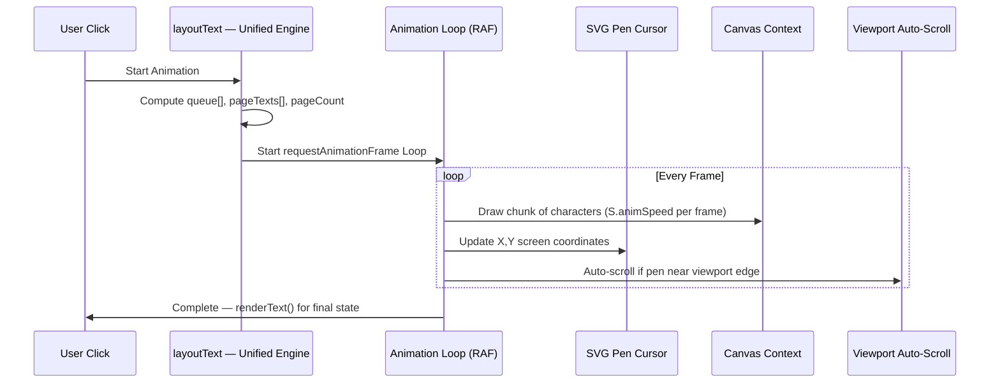
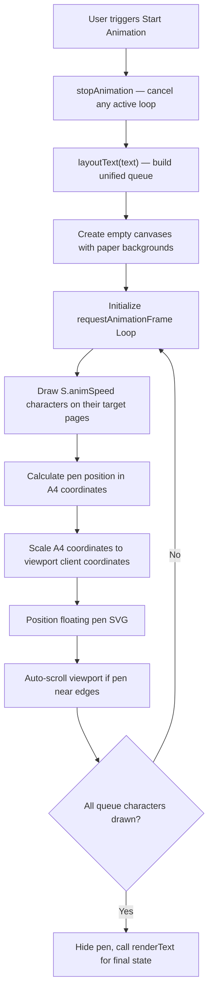

# 🎬 Animation Engine

This document describes Inkflow's live writing animation system — the unified layout engine integration, requestAnimationFrame loop, SVG pen tracking, viewport auto-scrolling, and coordinate calibration.

---

## Overview

The **✍ Animate** button converts static text into a real-time handwriting demonstration, writing each character one by one with a floating pen cursor that tracks the writing position across canvas pages.

In v1.2.0, the animation engine now uses the shared `layoutText()` function for all coordinate computation, ensuring pixel-perfect parity between static renders and animated playback.

---

## Animation Sequence



---

## Animation Pipeline



---

## Viewport Coordinate Calibration

The floating absolute SVG pen (`#pen-cursor`) must perfectly match canvas rendering coordinates across different screen dimensions:

```javascript
const rect = canvas.getBoundingClientRect();
const scaleX = rect.width / PAGE_W;
const scaleY = rect.height / PAGE_H;

penEl.style.left = (rect.left + item.x * scaleX) + 'px';
penEl.style.top = (rect.top + item.y * scaleY + window.scrollY) + 'px';
```

### Scale Calculations

$$\text{scaleX} = \frac{\text{getBoundingClientRect().width}}{\text{PAGE\_W}}$$
$$\text{scaleY} = \frac{\text{getBoundingClientRect().height}}{\text{PAGE\_H}}$$

---

## Auto-Scroll During Animation (v1.2.0)

The viewport automatically scrolls to keep the pen cursor visible:

```javascript
const targetScroll = rect.top + item.y * scaleY + window.scrollY - window.innerHeight / 2;
if (rect.top + item.y * scaleY < 120 || rect.top + item.y * scaleY > window.innerHeight - 120) {
  window.scrollTo({ top: Math.max(0, targetScroll), behavior: 'smooth' });
}
```

The 120px threshold ensures the pen stays comfortably within the viewport center rather than hugging the edges.

---

## Animation Speed Control

The `S.animSpeed` property (range: 1–30) controls how many characters are drawn per animation frame:

- **1–3**: Slow, dramatic writing for presentations
- **5–10**: Natural handwriting pace
- **15–30**: Fast fill for long documents

---

## Animation Completion

When the queue is exhausted, the engine:
1. Hides the pen cursor (`display: none`)
2. Sets `isAnimating = false`
3. Calls `renderText(S.text)` to ensure the final static state includes all page editor syncing and exact layout consistency

---

## Key Design Decisions

- **Unified `layoutText()`**: Both `renderText()` and `startAnimation()` call the same layout engine, guaranteeing identical character positions.
- **requestAnimationFrame** is used instead of `setInterval` for smooth, GPU-synced 60fps rendering with automatic throttling when the tab is backgrounded.
- **Character queue pre-computation** calculates all coordinates before animation starts, avoiding mid-animation layout recalculations.
- **Absolute positioning** for the pen cursor avoids CSS transform conflicts and ensures pixel-perfect tracking.
- **Auto-scroll** prevents the pen from writing off-screen during long document animations.
