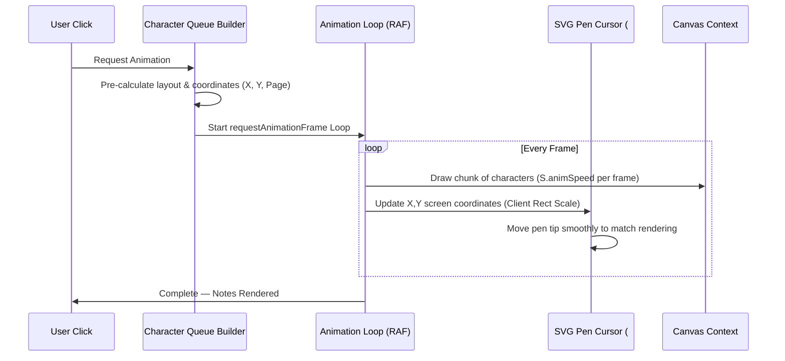
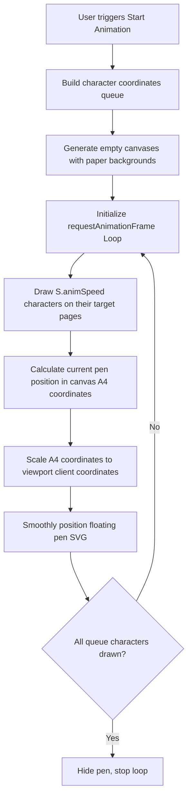

# 🎬 Animation Engine

This document describes Inkflow's live writing animation system — the character queue builder, requestAnimationFrame loop, and SVG pen tracking with viewport coordinate calibration.

---

## Overview

The **✍ Animate** button converts static text lines into a real-time handwriting demonstration, writing each character one by one with a floating pen cursor that tracks the writing position across the canvas.

---

## Animation Sequence



---

## Animation Pipeline



---

## Viewport Coordinate Calibration

A key technical challenge is ensuring the floating absolute SVG pen (`#pen-cursor`) perfectly matches the rendering position across different screen dimensions. The engine solves this with a matrix coordinate scaling system:

```javascript
const canvasEl = canvas;
const rect = canvasEl.getBoundingClientRect(); // Get actual viewport bounding boxes
const scaleX = rect.width / PAGE_W;            // Calculate horizontal stretch ratio
const scaleY = rect.height / PAGE_H;           // Calculate vertical stretch ratio

penEl.style.left = (rect.left + item.x * scaleX) + 'px';
penEl.style.top = (rect.top + item.y * scaleY + window.scrollY) + 'px';
```

### Scale Calculations

To map internal A4 canvas coordinates ($794 \times 1123$) to actual screen coordinates:

$$\text{scaleX} = \frac{\text{getBoundingClientRect().width}}{\text{PAGE\_W}}$$
$$\text{scaleY} = \frac{\text{getBoundingClientRect().height}}{\text{PAGE\_H}}$$

The SVG cursor is then positioned using:

$$\text{pen.left} = \text{rect.left} + x \times \text{scaleX}$$
$$\text{pen.top} = \text{rect.top} + y \times \text{scaleY} + \text{window.scrollY}$$

---

## Animation Speed Control

The `S.animSpeed` property (range: 1–30) controls how many characters are drawn per animation frame:

- **Low values (1–3)**: Slow, dramatic writing for presentations
- **Medium values (5–10)**: Natural handwriting pace
- **High values (15–30)**: Fast fill for long documents

---

## Key Design Decisions

- **requestAnimationFrame** is used instead of `setInterval` for smooth, GPU-synced 60fps rendering.
- **Character queue pre-computation** calculates all coordinates before animation starts, avoiding mid-animation layout recalculations.
- **Absolute positioning** for the pen cursor avoids CSS transform conflicts and ensures pixel-perfect tracking across page changes.
