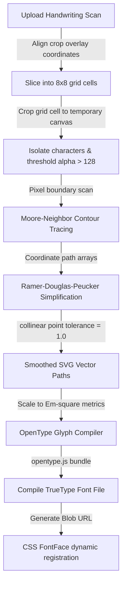

# 🔤 Custom Font Suite (HandFonted Studio)

This document describes the HandFonted Custom Font Suite — the template grid generator, raster-to-vector tracing pipeline, RDP curve simplification, and OpenType font compiler.

---

## Overview

The HandFonted Custom Font Suite operates completely inside the browser sandbox to perform raster-to-vector extraction, vector path smoothing, and client-side font compilation. Users can create personalized handwriting fonts by either sketching characters on the live sketchpad or uploading a scanned template sheet.

---

## Vector Tracing Pipeline



---

## 1. Printable Grid Sheet Layout

**Function**: `generateDownloadTemplate()`

- Renders a 1600×1600px canvas with an 8×8 grid (64 characters)
- Each cell is 175×175px with a dotted baseline helper at 70% height
- Small label tags in the top-left corner identify each character
- Writing area is kept completely blank for noise-free tracing
- Characters: `A-Z`, `a-z`, `0-9`, `.`, `,`

---

## 2. Moore-Neighbor Contour Tracing

Isolates character contours on a temporary canvas slice by scanning for active pixels (alpha > 128) and tracing the boundaries in a clockwise sequence.

- Traverses both external boundaries and internal negative outlines (holes, e.g. in 'o' or 'A')
- Assembles clean mathematical coordinate arrays for each closed contour

---

## 3. RDP Curve Simplification

Recursively smooths pixel contours using the Ramer-Douglas-Peucker algorithm:

- Drops redundant coordinates on straight segments
- Perpendicular distance tolerance: $\epsilon = 1.0$
- Preserves handwriting curves while reducing point count by ~60-80%

---

## 4. OpenType Font Compilation

- Coordinates scaled to 1000 units Em-square (advance width 500 units)
- Instantiates `opentype.Glyph` and `opentype.Path` elements
- Bundles all 64 glyphs inside an `opentype.Font` instance
- Generates TrueType Font byte array → Blob URL → CSS FontFace:

```javascript
const font = new FontFace('CustomHandwrittenFont', `url(${fontUrl})`);
await font.load();
document.fonts.add(font);
```

---

## Two Input Modes

### Live Sketchpad
Draw characters one-by-one on an interactive canvas with customizable pen settings. Each character is saved to the glyph tray independently.

### Upload Template
1. Download the blank 8×8 template grid
2. Print it, write all characters with a real pen
3. Scan or photograph the filled sheet
4. Upload and align using the interactive grid overlay sliders (X, Y, W, H)
5. The engine automatically slices and traces all 64 characters
