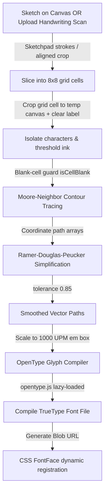

# 🔤 Custom Font Suite (HandFonted Studio)

This document describes the HandFonted Custom Font Suite — the template grid generator, raster-to-vector tracing pipeline, RDP curve simplification, and OpenType font compiler.

---

## Overview

The HandFonted Custom Font Suite operates completely inside the browser sandbox to perform raster-to-vector extraction, vector path smoothing, and client-side font compilation. Users can create personalized handwriting fonts by either sketching characters on the live sketchpad or uploading a scanned template sheet.

**Character Coverage** (two sheets, 84 characters total):
- **Letters**: 52 characters (`A–Z`, `a–z`)
- **Numbers & Symbols**: 32 characters (`0–9`, `. , ? ! @ # $ % ^ & * ( ) - _ + = / : ; ' "`)

---

## Vector Tracing Pipeline

```mermaid
flowchart TD
    A[Sketch on Canvas OR Upload Handwriting Scan] -->|Sketchpad strokes / aligned crop| B[Slice into 8x8 grid cells]
    B -->|Crop grid cell to temp canvas + clear label| C[Isolate characters & threshold ink]
    C -->|Blank-cell guard isCellBlank| D[Moore-Neighbor Contour Tracing]
    D -->|Coordinate path arrays| E[Ramer-Douglas-Peucker Simplification]
    E -->|tolerance 0.85| F[Smoothed Vector Paths]
    F -->|Scale to 1000 UPM em box| G[OpenType Glyph Compiler]
    G -->|opentype.js lazy-loaded| H[Compile TrueType Font File]
    H -->|Generate Blob URL| I[CSS FontFace dynamic registration]
```

---

## 1. Printable Template Package

**Function**: `generateDownloadTemplate()` — downloads **3 sheets** as PNGs (staggered to avoid browser blocking):
1. **Instructions cover** (1600×1600px) — setup and scanning guidance
2. **Letters grid** — 8×8 cells for `A–Z` + `a–z`
3. **Numbers & Symbols grid** — 8×8 cells for the 32 symbols

Each grid sheet is 1600×1600px with 175×175px cells, a dotted baseline helper at 70% height, and small label tags identifying each character.

---

## 2. Live Sketchpad

An interactive 256×256 canvas with:
- **Brush size control** (1–8px) and **undo** (stroke history with `redrawCanvas()`)
- **Character grid** with `drafted` state badges; switching sheets preserves progress
- **Ink guard**: `saveActiveCharacter()` calls `isCellBlank()` and refuses to save empty sketches
- **Save to IndexedDB**: `saveGlyphDB(char, dataUrl)` persists each glyph as a data URL (keyed by character)
- **Project save/load**: `exportFontProject()` / `importFontProject()` move the whole glyph set as a JSON file; imports run `pruneBlankGlyphs()` to strip stale blanks
- Progress bar tracks `completed / 84` characters

---

## 3. Template Upload & Alignment

1. Select the sheet (`Letters` or `Symbols`) and click **Download Template Package**.
2. Print, fill, scan/photograph (300 DPI recommended).
3. Upload via drag-and-drop or browse; each sheet keeps its own alignment image and grid offsets.
4. Align with the interactive **grid overlay sliders** (`Grid X/Y Offset`, `Grid W/H`) — a shaded bounding box plus an 8×8 grid is drawn over the scanned image. Configs are stored per sheet in `gridConfigs`.
5. `cropTemplateCell(index, sheetName)` slices each cell at 128×128 (scaling from the 360×360 preview), clearing the top-left guide label so it isn't traced as ink.

---

## 4. Moore-Neighbor Contour Tracing

`traceCanvasContours(canvas)` binarizes pixels (alpha > 50 and average brightness < 160 count as ink), then traces connected-component boundaries using an 8-direction neighbor search, tracking a `visited` mask so each contour is found exactly once. Contours with ≥ 3 points are smoothed and retained.

---

## 5. RDP Curve Simplification

`simplifyPath(points, tolerance)` applies the Ramer–Douglas–Peucker algorithm recursively:

- Tolerance: **0.85**
- Drops redundant coordinates on straight segments
- Preserves handwriting curves while reducing point count substantially

---

## 6. OpenType Font Compilation & Binary Export

`buildCustomFont()` (async):
1. Lazy-loads `opentype.js` 1.3.4 via `ensureOpentypeLoaded()`
2. Seeds the font with `.notdef` (advance 650) and `space` (advance 400) glyphs
3. For each of the 84 template characters, obtains a cell canvas from the sketchpad glyphs or the aligned template, **skips blank cells** (`isCellBlank`), and traces its path
4. `canvasToOpentypePath()` scales contours into the 1000-unit em box (fit within 600×700 units, centered) and closes the path
5. Computes per-glyph advance widths from the ink bounding box (min 250 units)
6. Builds `opentype.Font` (unitsPerEm 1000, ascender 800, descender −200), serializes to a TTF blob
7. Registers the result as a `FontFace`, appends it to the font selector, applies it, and re-renders
8. Aborts with a message if fewer than 2 glyphs are drafted

`exportCustomFontTTF()` (async):
- Compiles the custom handwriting vectors into a standalone `.ttf` TrueType Font binary file using `font.download(`${fontName}.ttf`)`.
- Allows users to export their custom drafted handwriting font directly to their operating system for installation in Windows, macOS, Microsoft Word, or Photoshop.

> **Blank-glyph hygiene**: `pruneBlankGlyphs()` runs on boot and after project imports, scanning each glyph for visible ink (`glyphHasInk`) and removing empty entries from memory and IndexedDB so they never render as invisible characters.

---

## Persistence

- Glyphs persist in **IndexedDB** (`InkflowDB` → `draftedGlyphs` store), bypassing the 5MB `localStorage` limit.
- Boot migration moves any legacy `localStorage` glyphs into IndexedDB and clears the old keys.
- Uploaded fonts register via `FontFace` at runtime and their names are remembered in `localStorage` (`inkflow-fonts`).
