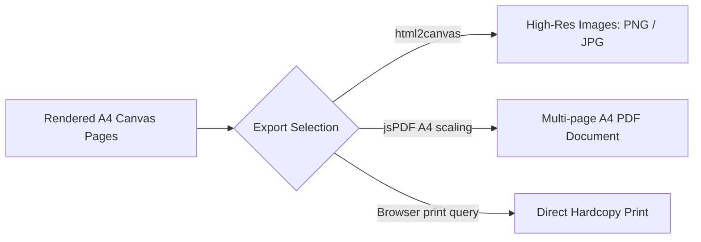

# 📤 Export Pipelines

This document describes Inkflow's multi-format export system — PNG/JPG images, multi-page PDF documents, and native print support.

---

## Export Architecture



---

## 1. High-Resolution Image Export (PNG / JPG)

Integrates `html2canvas` to screenshot `#page-container` at a scale of `1.5x`, supporting alpha transparency downloads (PNG) or high-quality compressed photography (JPG).

### Process
1. Target the `#page-container` DOM element
2. Capture at 1.5x scale for high-DPI output
3. Serialize canvas to data URL with appropriate MIME type
4. Create dynamic download anchor, append to DOM, trigger click, remove

---

## 2. Multi-Page PDF Export

Maps high-density image binaries into jsPDF A4 coordinate blocks ($210\text{mm} \times 297\text{mm}$):

```javascript
const doc = new jsPDF({ orientation: 'portrait', unit: 'mm', format: 'a4' });
for (let i = 0; i < pages.length; i++) {
  if (i > 0) doc.addPage();
  const imgData = pages[i].toDataURL('image/jpeg', 0.92);
  doc.addImage(imgData, 'JPEG', 0, 0, 210, 297);
}
doc.save('inkflow-notes.pdf');
```

### Features
- Automatic multi-page compilation
- JPEG compression at 92% quality
- Standard A4 dimensions (210mm × 297mm)
- Portrait orientation

---

## 3. Native Print

Includes custom `@media print` CSS overrides that hide control panels, sidebars, headers, and navigation pills, printing only the high-quality notes pages.

```css
@media print {
  #sidebar, #toolbar, .page-nav, #hamburger { display: none !important; }
  #canvas-area { margin: 0; padding: 0; }
  .page { break-after: page; }
}
```

---

## Cross-Browser Download Fix

Modern browsers block `.click()` on detached anchor elements. All downloads use the DOM-attach pattern:

```javascript
const link = document.createElement('a');
link.download = 'filename.ext';
link.href = dataUrl;
document.body.appendChild(link);  // Attach to DOM first
link.click();
document.body.removeChild(link);  // Clean up immediately
```
