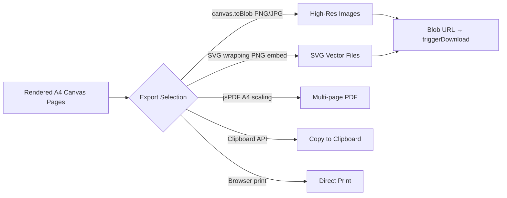

# 📤 Export Pipelines

This document describes Inkflow's multi-format export system — PNG/JPG image, SVG vector wrapper, multi-page PDF, clipboard copy, and native print support.

---

## Export Architecture



---

## 1. Image Export (PNG / JPG)

Reads directly from `pages[]` canvas elements at native A4 resolution ($794 \times 1123\text{px}$) using `canvas.toBlob()`. No screenshot library required.

### Process
1. Blur any active `.page-editor` overlay and wait 320ms for clean canvas state
2. Call `canvas.toBlob(callback, mimeType, quality)` for each page
3. Create a Blob URL via `URL.createObjectURL(blob)`
4. Trigger download via `triggerDownload(url, filename)`
5. Revoke the Blob URL after 1 second to free memory

| Format | MIME Type | Quality | Notes |
| :--- | :--- | :--- | :--- |
| PNG | `image/png` | 1.0 | Lossless, full alpha |
| JPG | `image/jpeg` | 0.93 | High quality, smaller file |

> **v1.2.0 Change**: Replaced `html2canvas` screenshot capture with native `canvas.toBlob()`. This removes a CDN dependency, improves pixel accuracy, and resolves Chrome's download tray invisibility for files over 2MB.

---

## 2. SVG Export

Wraps a full-resolution PNG data URL inside a standard SVG `<image>` element:

```javascript
const svgContent = `<?xml version="1.0" encoding="UTF-8"?>
<svg xmlns="http://www.w3.org/2000/svg" width="${PAGE_W}" height="${PAGE_H}">
  <image href="${imgData}" x="0" y="0" width="${PAGE_W}" height="${PAGE_H}"/>
</svg>`;
const blob = new Blob([svgContent], { type: 'image/svg+xml' });
triggerDownload(URL.createObjectURL(blob), 'inkflow-notes.svg');
```

For multi-page documents: `inkflow-notes-page1.svg`, `inkflow-notes-page2.svg`, etc.

---

## 3. Multi-Page PDF Export

Maps canvas image binaries into jsPDF A4 blocks ($210\text{mm} \times 297\text{mm}$) with progress toasts:

```javascript
const doc = new jsPDF({ orientation: 'portrait', unit: 'mm', format: 'a4', compress: true });
for (let i = 0; i < pages.length; i++) {
  showExportToast(`Building PDF (Page ${i + 1}/${pages.length})…`, 'info');
  if (i > 0) doc.addPage();
  const imgData = pages[i].toDataURL('image/jpeg', 0.93);
  doc.addImage(imgData, 'JPEG', 0, 0, 210, 297, undefined, 'FAST');
}
doc.save('inkflow-notes.pdf');
```

---

## 4. Copy to Clipboard

Copies the current page as a PNG image to the system clipboard:

```javascript
canvas.toBlob(async (blob) => {
  await navigator.clipboard.write([new ClipboardItem({ 'image/png': blob })]);
}, 'image/png', 1.0);
```

---

## 5. Native Print

Custom `@media print` CSS overrides hide UI, printing only notes pages.

---

## Export Toast Notifications

All exports display non-blocking toast feedback via `showExportToast(msg, type)`:

| Type | Trigger | Auto-dismiss |
| :--- | :--- | :--- |
| `info` | Progress ("Building PDF…") | No |
| `success` | Complete | 3 seconds |
| `warn` | Nothing to export | 3 seconds |
| `error` | Failure | 3 seconds |

---

## Shared Download Helper — `triggerDownload(url, filename)`

```javascript
function triggerDownload(url, filename) {
  const a = document.createElement('a');
  a.href = url; a.download = filename; a.style.display = 'none';
  document.body.appendChild(a); a.click(); document.body.removeChild(a);
}
```

---

## Pre-Export State Handling

Before any export: checks `pages.length > 0`, blurs active `.page-editor`, and awaits 320ms for the blur/redraw cycle to complete.
