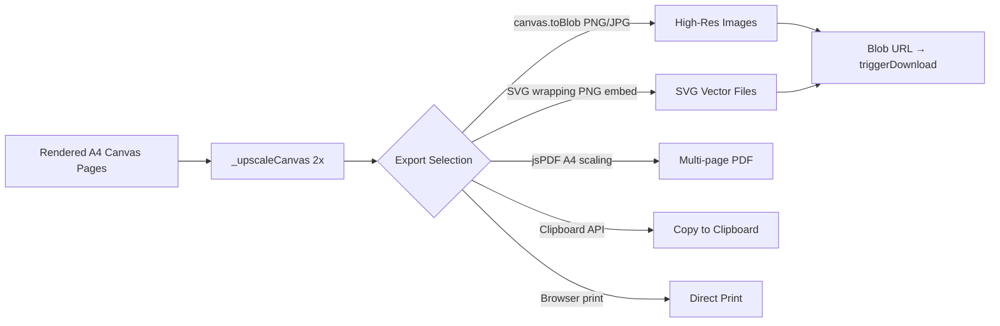

# 📤 Export Pipelines

This document describes Inkflow's multi-format export system — 2×-upscaled PNG/JPG image export, SVG vector wrapper, lossless multi-page PDF, clipboard copy, and native print support.

---

## Export Architecture


```mermaid
graph LR
    A[Rendered A4 Canvas Pages] --> UP[_upscaleCanvas 2x]
    UP --> B{Export Selection}
    B -->|canvas.toBlob PNG/JPG| C[High-Res Images]
    B -->|SVG wrapping PNG embed| D[SVG Vector Files]
    B -->|jsPDF A4 scaling| E[Multi-page PDF]
    B -->|Clipboard API| F[Copy to Clipboard]
    B -->|Browser print| G[Direct Print]
    C --> H[Blob URL → triggerDownload]
    D --> H
```

---

## High-Resolution Upscaling

Since v1.4.0 every raster export runs the source canvas through `_upscaleCanvas(src, scale)`:

```javascript
function _upscaleCanvas(src, scale) {
  const hq = document.createElement('canvas');
  hq.width  = src.width  * scale;
  hq.height = src.height * scale;
  const ctx = hq.getContext('2d');
  ctx.imageSmoothingEnabled = true;
  ctx.imageSmoothingQuality = 'high';
  ctx.drawImage(src, 0, 0, hq.width, hq.height);
  return hq;
}
```

The `EXPORT_SCALE` / `PDF_SCALE` factor is **2**, producing ~150 DPI output from the 794×1123 native canvas.

---

## 1. Image Export (PNG / JPG)

Reads from `pages[]` canvas elements and upsamples 2× before encoding via `canvas.toBlob()`. No screenshot library required.

### Process
1. Blur any active `.page-editor` overlay and wait 320ms for clean canvas state
2. `_upscaleCanvas(pages[i], 2)` for each page
3. Call `hq.toBlob(callback, mimeType, quality)`
4. Create a Blob URL via `URL.createObjectURL(blob)`
5. Trigger download via `triggerDownload(url, filename)`
6. Revoke the Blob URL after 1 second to free memory

| Format | MIME Type | Quality | Notes |
| :--- | :--- | :--- | :--- |
| PNG | `image/png` | 1.0 | Lossless, full alpha |
| JPG | `image/jpeg` | 0.97 | Near-lossless, smaller file |

Single-page documents export one file (`inkflow-notes.png`); multi-page documents export one file per page (`inkflow-notes-page1.png`, …).

> **v1.2.0 Change**: Replaced `html2canvas` screenshot capture with native `canvas.toBlob()`. The `html2canvas` CDN script remains loaded in `index.html` but is no longer referenced by any export path.

---

## 2. SVG Export

Wraps a full-resolution PNG data URL inside a standard SVG `<image>` element:

```javascript
const svgContent = `<?xml version="1.0" encoding="UTF-8"?>
<svg xmlns="http://www.w3.org/2000/svg" width="${PAGE_W}" height="${PAGE_H}"
     viewBox="0 0 ${PAGE_W} ${PAGE_H}">
  <image href="${imgData}" x="0" y="0" width="${PAGE_W}" height="${PAGE_H}"/>
</svg>`;
const blob = new Blob([svgContent], { type: 'image/svg+xml' });
triggerDownload(URL.createObjectURL(blob), 'inkflow-notes.svg');
```

For multi-page documents: `inkflow-notes-page1.svg`, `inkflow-notes-page2.svg`, etc.

---

## 3. Multi-Page PDF Export

Maps 2×-upscaled lossless PNG pages into jsPDF A4 blocks (210mm × 297mm) with progress toasts:

```javascript
const PDF_SCALE = 2;
const doc = new jsPDF({
  orientation: 'portrait', unit: 'mm', format: 'a4',
  compress: false, // avoid double-compression on top of PNG
});
for (let i = 0; i < pages.length; i++) {
  if (i > 0) doc.addPage();
  const hq = _upscaleCanvas(pages[i], PDF_SCALE);
  const imgData = hq.toDataURL('image/png', 1.0);
  doc.addImage(imgData, 'PNG', 0, 0, 210, 297, undefined, 'NONE');
}
doc.save('inkflow-notes.pdf');
```

> **v1.4.0 Change**: PDFs now embed lossless PNG with `NONE` compression instead of JPEG/`FAST`, giving pixel-perfect print/archive quality at a slightly larger file size.

---

## 4. Copy to Clipboard

Copies the current page as a PNG image to the system clipboard:

```javascript
canvas.toBlob(async (blob) => {
  await navigator.clipboard.write([new ClipboardItem({ 'image/png': blob })]);
}, 'image/png', 1.0);
```

---

## 5. Native Print

Custom `@media print` CSS overrides hide UI, printing only notes pages.

---

## Export Toast Notifications

All exports display non-blocking toast feedback via `showExportToast(msg, type)`:

| Type | Trigger | Auto-dismiss |
| :--- | :--- | :--- |
| `info` | Progress ("Building PDF…") | No |
| `success` | Complete | 3 seconds |
| `warn` | Nothing to export | 3 seconds |
| `error` | Failure | 3 seconds |

---

## Shared Download Helper — `triggerDownload(url, filename)`

```javascript
function triggerDownload(url, filename) {
  const a = document.createElement('a');
  a.href = url; a.download = filename; a.style.display = 'none';
  document.body.appendChild(a); a.click(); document.body.removeChild(a);
}
```

---

## Pre-Export State Handling

Before any export: checks `pages.length > 0`, blurs active `.page-editor`, and awaits 320ms for the blur/redraw cycle to complete. Failing conditions surface as a `warn` toast ("Nothing to export — add some text first.").
