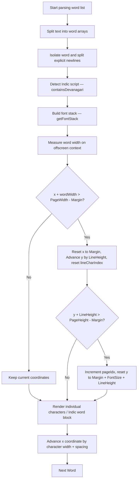

# ✒️ Handwriting Synthesis Engine

This document details Inkflow's core handwriting rendering algorithm — the unified layout engine, per-character transformation loop, glyph variation system, ink bleed simulation, Indic script support, and word-wrap calculations.

---

## Overview

Inkflow uses a character-by-character render loop on standard 2D canvas contexts rather than rendering unified, static text lines. Each letter has custom variations applied, introducing the minor imperfections that make real handwriting look authentic.

The entire layout computation is centralized in the **`layoutText(text)`** function, which is shared by both static rendering and animation playback.

---

## Unified Layout Engine — `layoutText(text)`

The `layoutText` function is the single source of truth for all character coordinates. It:

1. Sanitizes the input via `sanitizeText()`
2. Detects Indic/Devanagari content via `containsDevanagari()`
3. Builds the correct font stack via `getFontStack()`
4. Measures word widths on an offscreen canvas context
5. Applies word-wrap and page-break logic
6. Calls `getCharVariation()` for each character
7. Returns a `queue[]` of character render items and `pageTexts[]`

```javascript
const { queue, pageTexts, pageCount } = layoutText(text);
```

---

## Helper Functions

### `sanitizeText(str)`
Strips non-printable control characters (U+0000–U+001F, PUA) to prevent canvas rendering corruption.

### `getGraphemes(text)`
Correctly segments a string into individual grapheme clusters using `Intl.Segmenter` (with an `Array.from()` fallback). This ensures emoji and multi-codepoint characters are handled as single units.

### `isIndicScript(text)` / `containsDevanagari(text)`
Detects Indic script characters via Unicode range regex covering Devanagari, Bengali, Gurmukhi, Gujarati, Odia, Tamil, Telugu, Kannada, Malayalam, and Sinhala ranges:

```javascript
/[\u0900-\u097F\uA8E0-\uA8FF\u1CD0-\u1CFF\u0980-\u09FF...]/
```

### `getFontStack(isIndic)`
Returns the correct CSS font-family string. If the selected font does not natively support Devanagari, it appends fallbacks:

```javascript
return `"${S.font}", "Noto Sans Devanagari", "Hind", sans-serif`;
```

---

## Per-Character Transformation Loop

The mathematical core of character rendering computes randomized transforms, baselines, and stroke properties for every individual glyph. All offsets scale proportionally with `fontSize` so the handwriting looks natural at any size.

$$k = \text{FontSize} / 22$$
$$\text{Tilt} = \text{random}(-\text{rotMax}, \text{rotMax})$$
$$\text{Scale}_X = \text{random}(0.98, 1.02)$$
$$\text{Scale}_Y = \text{random}(0.97, 1.03)$$
$$\text{Baseline Offset} = \text{random}(-0.4, 0.4) \times k$$
$$\text{Spacing Adjust} = \text{random}(-0.4, 0.6) \times k$$

These transforms are applied within the character rendering matrix:

```javascript
const v = getCharVariation(S.rotationMax, S.pressure, S.fontSize);
// lineCharIndex resets at each new line — prevents drift accumulation
const wobble = Math.sin(lineCharIndex * 0.04) * 0.8 * (S.fontSize / 22);
const cy = y + v.baselineOff + wobble;

ctx.save();
ctx.translate(item.x, item.y);
ctx.rotate((v.tiltDeg * Math.PI) / 180);
ctx.scale(v.scaleX, v.scaleY);
```

> **Key fix (v1.2.0)**: The `wobble` function now uses `lineCharIndex` (reset to 0 at every line break) instead of the global `charIndex`. This eliminates the zigzag/typewriter artifact that appeared on long passages.

---

## Pen Pressure & Ink Bleed Simulation

### Pressure Modulation
True pen handwriting shows varied thickness depending on velocity and pressure. Inkflow models this by scaling the active font-size for each character by a dynamic `pressureMod`:

$$\text{Size}_{\text{px}} = \text{FontSize} \times \left(1 - \text{random}(0, \text{Pressure} \times 1.4)\right)$$

### Ink Bleed
Real paper fibers absorb ink, causing microscopic bleeds. This is simulated by layering a drop shadow using the canvas shadow context with a small blur factor:

```javascript
if (S.bleed > 0.05) {
  ctx.shadowColor = S.inkColor;
  ctx.shadowBlur = S.bleed * 1.4;
}
```

---

## Indic Script Rendering

Indic words are rendered as a single block (not character-by-character) to preserve Devanagari shaping rules. The tilt is damped to 30% to avoid breaking connected ligatures:

```javascript
if (wordIsIndic) {
  ctx.rotate((v.tiltDeg * 0.3 * Math.PI) / 180); // Reduced tilt
  ctx.fillText(item.ch, 0, 0); // Whole word at once
}
```

---

## Word Wrap & Page Break Algorithm



### Synthesis Algorithm Summary

1. **Sanitize**: Strip control characters via `sanitizeText()`.
2. **Word Split**: The input text is split by whitespace into an array of words. Explicit newlines (`\n`) trigger forced line breaks.
3. **Script Detection**: Each word is tested for Indic script characters.
4. **Font Stack**: The correct CSS font-family string is built, including Devanagari fallbacks if needed.
5. **Width Measurement**: Each word's pixel width is measured using an offscreen canvas context with the active font settings.
6. **Wrap Check**: If adding the word would exceed `PageWidth - margin`, the cursor resets to the left margin, advances vertically by `fontSize × lineHeight`, and `lineCharIndex` resets to 0.
7. **Page Break**: If the vertical cursor exceeds `PageHeight - margin`, `pageIdx` increments and the cursor resets to start on the **second line** of the new page (skipping the first ruled line).
8. **Character Render & Character Wrap**: Non-Indic words are rendered character-by-character with unique randomized tilt, scale, baseline offset, and pressure variation. As characters are rendered, if the horizontal cursor position plus the character width exceeds the right boundary, the layout engine performs a **character-level soft wrap** to the next line (resetting the cursor to the left margin, advancing vertically, and checking for page breaks). Indic words are rendered as single blocks with reduced tilt.
9. **Cursor Advance**: After each character/word, the horizontal cursor advances by the measured width plus a randomized spacing adjustment.

---

## Key Design Decisions

- **Unified `layoutText()`** ensures identical layout between static renders and animation — previously a source of visual discrepancy.
- **`lineCharIndex` vs `charIndex`**: Using per-line indexing for the wobble function prevents baseline drift accumulation across long documents.
- **Individual character rendering** (vs. full-word rendering) creates far more realistic handwriting at the cost of slightly more computation.
- **Proportional Scaling**: The engine scales baseline variation, spacing variations, and sinusoidal wobble based on `FontSize / 22`, eliminating jagged artifacts at larger font sizes.
- **Drop shadow ink bleed** is computationally inexpensive via the canvas shadow API and avoids complex pixel-level blending.
