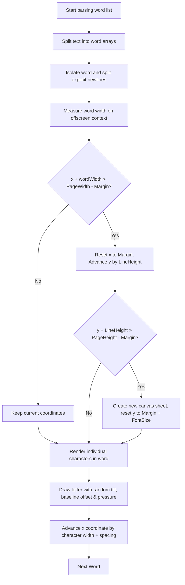

# ✒️ Handwriting Synthesis Engine

This document details Inkflow's core handwriting rendering algorithm — the per-character transformation loop, glyph variation system, ink bleed simulation, and word-wrap calculations.

---

## Overview

Inkflow uses a character-by-character render loop on standard 2D canvas contexts rather than rendering unified, static text lines. Each letter has custom variations applied, introducing the minor mistakes that make real handwriting look authentic.

---

## Per-Character Transformation Loop

The mathematical core of character rendering computes randomized transforms, baselines, and stroke properties for every individual glyph:

$$k = \text{FontSize} / 22$$
$$Tilt = \text{random}(-\text{rotMax}, \text{rotMax})$$
$$\text{Scale}_X = \text{random}(0.97, 1.03)$$
$$\text{Scale}_Y = \text{random}(0.95, 1.05)$$
$$\text{Baseline Offset} = \text{random}(-1.5, 1.5) \times k$$
$$\text{Spacing Adjust} = \text{random}(-0.6, 1.0) \times k$$

These transforms are compiled within the character rendering matrix:

```javascript
const v = getCharVariation(S.rotationMax, S.pressure, S.fontSize);
const wobble = Math.sin(charIndex * 0.18) * 0.8 * (S.fontSize / 22); // Proportional sinusoidal hand drift
const cy = y + v.baselineOff + wobble;

ctx.save();
ctx.translate(x, cy);
ctx.rotate((v.tiltDeg * Math.PI) / 180);
ctx.scale(v.scaleX, v.scaleY);
```

---

## Pen Pressure & Ink Bleed Simulation

### Pressure Modulation
True pen handwriting shows varied thickness depending on velocity and pressure. Inkflow models this by scaling the active font-size for each character by a dynamic `pressureMod`:

$$\text{Size}_{\text{px}} = \text{FontSize} \times \left(1 - \text{random}(0, \text{Pressure} \times 2)\right)$$

### Ink Bleed
Real paper fibers absorb ink, causing microscopic bleeds. This is simulated by layering a drop shadow using the canvas shadow context with a small blur factor:

```javascript
if (S.bleed > 0.05) {
  ctx.shadowColor = S.inkColor;
  ctx.shadowBlur = S.bleed * 1.4;
}
```

---

## Word Wrap & Page Break Algorithm



### Synthesis Algorithm Summary

1. **Word Split**: The input text is split by whitespace into an array of words. Explicit newlines (`\n`) trigger forced line breaks.
2. **Width Measurement**: Each word's pixel width is measured using an offscreen canvas context with the active font settings.
3. **Wrap Check**: If adding the word would exceed `PageWidth - margin`, the cursor resets to the left margin and advances vertically by `fontSize × lineHeight`.
4. **Page Break**: If the vertical cursor exceeds `PageHeight - margin`, a new canvas page is created and the cursor resets.
5. **Character Render**: Each character is drawn individually with its unique randomized tilt, scale, baseline offset, and pressure variation.
6. **Cursor Advance**: After each character, the horizontal cursor advances by the measured character width plus a randomized spacing adjustment.

---

## Key Design Decisions

- **Individual character rendering** (vs. full-word rendering) creates far more realistic handwriting at the cost of slightly more computation.
- **Proportional Scaling**: The engine scales baseline variation, spacing variations, and sinusoidal wobble based on `FontSize / 22`. This eliminates jagged "zigzag/typewriter" artifacts at larger font sizes and provides a uniform handwritten look.
- **Sinusoidal wobble** (`Math.sin(charIndex * 0.18) * 0.8 * k`) adds a natural hand-drift pattern that repeats subtly across lines.
- **Clean Font Fallbacks**: Standard fonts like Roboto and Arial are included as fallbacks and bypass certain rendering passes (like wobble and baseline offset) if desired by the user.
- **Drop shadow ink bleed** is computationally inexpensive via the canvas shadow API and avoids complex pixel-level blending.
