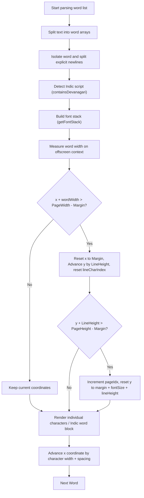

<p align="center">
  
</p>

# ✒️ Handwriting Synthesis Engine

This document details Inkflow's core handwriting rendering algorithm — the unified layout engine, per-character transformation loop, glyph variation system, ink bleed simulation, Indic script support, rich study syntax, and word-wrap calculations.

---

## Overview

Inkflow uses a character-by-character render loop on standard 2D canvas contexts rather than rendering unified, static text lines. Each letter has custom variations applied, introducing the minor imperfections that make real handwriting look authentic.

The entire layout computation is centralized in the **`layoutText(text)`** function, which is shared by both static rendering and animation playback. It delegates to `layoutTextTemplated()`, which uses a zone-based template system via `window.templateManager.resolveTemplate()` to position text within the active layout zones (standard, two-column, Cornell, meeting).

---

## Pre-Processing: Block Parsing

Before layout, `parseBlocks(text)` (aliased from `window.TextLayout.parseBlocks`) scans the raw text and extracts structured blocks:

| Syntax | Parsed As |
| :--- | :--- |
| ```` ```mermaid ```` blocks | Mermaid diagram render items |
| ```` ```diagram ```` blocks | Custom JSON diagram render items |
| Plain text paragraphs | Standard text blocks |

The parser returns an array of block objects. Diagram blocks are rendered via the diagram engine; text blocks flow through the layout pipeline.

---

## Unified Layout Engine — `layoutText(text)`

`layoutText` is the single source of truth for all character coordinates. It:

1. Sanitizes the input via `sanitizeText()`
2. Parses rich syntax via `parseRichSyntax()`
3. Routes to the engine matching the active `paperStyle` / `noteLayout`
4. Measures word/character widths on an offscreen canvas context
5. Applies word-wrap, character-wrap, and page-break logic
6. Calls `getCharVariation()` for each character (unless suppressed)
7. Returns a `queue[]` of character render items and `pageTexts[]`

```javascript
const { queue, pageTexts, pageCount } = layoutText(text);
```

Each page starts one font size below the first ruled line (`y = margin + fontSize + lineHeight`), creating a natural notebook look with space for the first ruling line.

---

## Helper Functions

### `sanitizeText(str)`
Strips non-printable control characters (U+0000–U+001F, PUA) to prevent canvas rendering corruption.

### `getGraphemes(text)`
Correctly segments a string into individual grapheme clusters using `Intl.Segmenter` (with an `Array.from()` fallback). This ensures emoji and multi-codepoint characters are handled as single units.

### `isIndicScript(text)` / `containsDevanagari(text)`
Detects Indic script characters via a Unicode range regex covering Devanagari, Bengali, Gurmukhi, Gujarati, Odia, Tamil, Telugu, Kannada, Malayalam, and Sinhala ranges:

```javascript
/[\u0900-\u097F\uA8E0-\uA8FF\u1CD0-\u1CFF\u0980-\u09FF...]/
```

### `getFontStack(isIndic)`
Returns the correct CSS font-family string. If the selected font does not natively support Devanagari, it appends fallbacks:

```javascript
return `"${S.font}", "Noto Sans Devanagari", "Hind", sans-serif`;
```

### `getAlignmentOffset(alignment, fontSize, lineHeight)`
Returns the vertical baseline offset for the text alignment control relative to notebook line baselines: `middle` (default) returns `0` (text centered between lines), `bottom` ("Lower") returns `lineH * 0.35` (text sits lower on the line), and `top` ("Upper") returns `-(lineH * 0.35)` (text sits higher on the line).

---

## Per-Character Transformation Loop

The mathematical core of character rendering computes randomized transforms, baselines, and stroke properties for every individual glyph. All offsets scale proportionally with `fontSize` so the handwriting looks natural at any size.

$$k = \text{FontSize} / 22$$
$$\text{Tilt} = \text{random}(-\text{rotMax}, \text{rotMax})$$
$$\text{Scale}_X = \text{random}(0.98, 1.02)$$
$$\text{Scale}_Y = \text{random}(0.97, 1.03)$$
$$\text{Baseline Offset} = \text{random}(-0.4, 0.4) \times k$$
$$\text{Spacing Adjust} = \text{random}(-0.4, 0.6) \times k$$
$$\text{Pressure Modifier} = 1 - \text{random}(0, \text{Pressure} \times 1.4)$$
$$\text{Opacity} = \text{random}(0.92, 1.0)$$

These transforms are applied within the character rendering matrix:

```javascript
const v = getCharVariation(S.rotationMax, S.pressure, S.fontSize);
// lineCharIndex resets at each new line — prevents drift accumulation
const wobbleAmplitude = item.isIndic ? 0.4 : 0.8;
const wobble = Math.sin(lineCharIndex * 0.04) * wobbleAmplitude * (S.fontSize / 22);
const alignOffset = getAlignmentOffset(S.textAlignment, S.fontSize, S.lineHeight);
const cy = y + v.baselineOff + wobble + alignOffset;

ctx.save();
ctx.translate(item.x, item.y);
ctx.rotate((v.tiltDeg * (item.isIndic ? 0.3 : 1) * Math.PI) / 180);
ctx.scale(v.scaleX, v.scaleY);
```

> **Key fix (v1.2.0)**: The `wobble` function now uses `lineCharIndex` (reset to 0 at every line break) instead of the global `charIndex`. This eliminates the zigzag/typewriter artifact that appeared on long passages.

> **Indic script**: Wobble amplitude is reduced to 0.4 (vs 0.8 for Latin) and tilt is pre-scaled by 0.3 at layout time and again by 0.3 at render time, producing a 9% effective tilt for connected Devanagari ligatures.

---

## Drafted Glyph Rendering

When a character has a user-drafted glyph (`draftedGlyphs[ch]`), it is drawn as an image instead of a font character (bypassed in `clean` mode):

```javascript
const glyphImg = getCachedGlyphImage(item.ch, draftedGlyphs[item.ch]);
if (glyphImg) {
  const drawSz = S.fontSize * 1.35;
  ctx.drawImage(glyphImg, -drawSz / 2, -drawSz / 2, drawSz, drawSz);
}
```

`getCachedGlyphImage()` maintains a decoded-image cache keyed by character. Entries are only drawn once the image is fully decoded (`ready` flag), so `drawImage()` always runs synchronously inside the correct `save()/translate()/restore()` block. The `debounceRender()` call on load swaps the system-font placeholder for the real stroke.

---

## Pen Pressure & Ink Bleed Simulation

### Pressure Modulation
True pen handwriting shows varied thickness depending on velocity and pressure. Inkflow models this by scaling the active font-size for each character by a dynamic `pressureMod`:

$$\text{Size}_{\text{px}} = \text{FontSize} \times \left(1 - \text{random}(0, \text{Pressure} \times 1.4)\right)$$

### Ink Bleed
Real paper fibers absorb ink, causing microscopic bleeds. This is simulated by layering a drop shadow using the canvas shadow context with a small blur factor:

```javascript
if (S.bleed > 0.05) {
  ctx.shadowColor = S.shadowColor || S.inkColor;
  ctx.shadowBlur = S.bleed * 1.4;
}
```

---

## Indic Script Rendering

Indic words are rendered as a single block (not character-by-character) to preserve Devanagari shaping rules. The tilt is damped to 9% (pre-scaled by 0.3 at layout time, then 0.3 at render time) to avoid breaking connected ligatures. The wobble amplitude is also reduced to 50% (0.4 vs 0.8).

---

## Word Wrap & Page Break Algorithm


```mermaid
flowchart TD
    A["Start parsing word list"] --> B["Split text into word arrays"]
    B --> C["Isolate word and split explicit newlines"]
    C --> D["Detect Indic script (containsDevanagari)"]
    D --> E["Build font stack (getFontStack)"]
    E --> F["Measure word width on offscreen context"]
    F --> G{"x + wordWidth > PageWidth - Margin?"}
    G -->|"Yes"| H["Reset x to Margin, Advance y by LineHeight, reset lineCharIndex"]
    G -->|"No"| I["Keep current coordinates"]
    H --> J{"y + LineHeight > PageHeight - Margin?"}
    I --> K["Render individual characters / Indic word block"]
    J -->|"Yes"| L["Increment pageIdx, reset y to margin + fontSize + lineHeight"]
    J -->|"No"| K
    L --> K
    K --> M["Advance x coordinate by character width + spacing"]
    M --> N["Next Word"]
```

### Synthesis Algorithm Summary

1. **Sanitize**: Strip control characters via `sanitizeText()`.
2. **Block Parse**: Extract diagram blocks via `parseBlocks()`; text blocks flow through layout.
3. **Word Split**: The cleaned text is split by whitespace into an array of words. Explicit newlines (`\n`) trigger forced line breaks.
4. **Script Detection**: Each word is tested for Indic script characters.
5. **Font Stack**: The correct CSS font-family string is built, including Devanagari fallbacks if needed.
6. **Width Measurement**: Each word's pixel width is measured using an offscreen canvas context with the active font settings.
7. **Wrap Check**: If adding the word would exceed `PageWidth - margin`, the cursor resets to the left margin, advances vertically by `fontSize × lineHeight`, and `lineCharIndex` resets to 0.
8. **Page Break**: If the vertical cursor exceeds `PageHeight - margin`, `pageIdx` increments and the cursor resets to start one font size below the top margin.
9. **Character Render & Character Wrap**: Non-Indic words are rendered character-by-character with unique randomized tilt, scale, baseline offset, and pressure variation. If a single character exceeds the right boundary, a **character-level soft wrap** to the next line occurs. Indic words are rendered as single blocks with 9% effective tilt.
10. **Cursor Advance**: After each character/word, the horizontal cursor advances by the measured width plus a randomized spacing adjustment.

---

## Key Design Decisions

- **Unified `layoutText()`** ensures identical layout between static renders and animation — previously a source of visual discrepancy.
- **`lineCharIndex` vs `charIndex`**: Using per-line indexing for the wobble function prevents baseline drift accumulation across long documents.
- **Individual character rendering** (vs. full-word rendering) creates far more realistic handwriting at the cost of slightly more computation.
- **Proportional Scaling**: The engine scales baseline variation, spacing variations, and sinusoidal wobble based on `FontSize / 22`, eliminating jagged artifacts at larger font sizes.
- **Drop shadow ink bleed** is computationally inexpensive via the canvas shadow API and avoids complex pixel-level blending.
