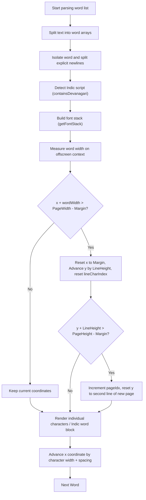

<p align="center">
  
</p>

# ✒️ Handwriting Synthesis Engine

This document details Inkflow's core handwriting rendering algorithm — the unified layout engine, per-character transformation loop, glyph variation system, ink bleed simulation, Indic script support, rich study syntax, and word-wrap calculations.

---

## Overview

Inkflow uses a character-by-character render loop on standard 2D canvas contexts rather than rendering unified, static text lines. Each letter has custom variations applied, introducing the minor imperfections that make real handwriting look authentic.

The entire layout computation is centralized in the **`layoutText(text)`** function, which is shared by both static rendering and animation playback, and dispatches to four layout engines:

| Route | Trigger |
| :--- | :--- |
| `layoutTextCleanStandard` | `paperStyle === 'clean'` and `noteLayout === 'standard'` |
| `layoutTextTwoColumn` | `noteLayout === 'twocolumn'` |
| `layoutTextCornell` | `noteLayout === 'cornell'` |
| Standard flowing engine | default (in `layoutText`) |

---

## Pre-Processing: Rich Study Syntax

Before layout, `parseRichSyntax(rawText)` scans the raw text and extracts study artifacts, replacing them with private-use placeholder characters (`\uFFF0` / `\uFFF1`) that the layout engines treat as anchor points:

| Syntax | Extracted Artifact | Drawn As |
| :--- | :--- | :--- |
| `[sticky:color] content [sticky]` | `parsedStickies[]` | A sticky note floating in the right margin (yellow, cyan, pink, mint). |
| `[callout:type] content [callout]` | `parsedCallouts[]` | A boxed tag in the left margin (warning, info, formula) with an icon. |
| `==content==` | `highlightRanges[]` | A translucent highlight rectangle behind the characters. |
| `Q: question` / `A: answer` pairs | `activeFlashcards[]` | A review deck in the Flashcards modal. |

The parser returns `{ cleanText, flashcards }`; `cleanText` is what actually flows through layout. `paintStickyNotes()` and `paintCallouts()` run as post-passes over the queue.

---

## Unified Layout Engine — `layoutText(text)`

`layoutText` is the single source of truth for all character coordinates. It:

1. Sanitizes the input via `sanitizeText()`
2. Parses rich syntax via `parseRichSyntax()`
3. Routes to the engine matching the active `paperStyle` / `noteLayout`
4. Measures word/character widths on an offscreen canvas context
5. Applies word-wrap, character-wrap, and page-break logic — a row is refused only when its baseline plus half a font size (`y + S.fontSize * 0.5`) would cross the bottom margin (v1.6.5: previously required the full next line box, wasting 1–2 bottom lines per page)
6. Calls `getCharVariation()` for each character (unless suppressed)
7. Returns a `queue[]` of character render items and `pageTexts[]`

```javascript
const { queue, pageTexts, pageCount } = layoutText(text);
```

Each page starts on its **second ruled line** (`y = margin + lineHeight * 2`), skipping the first line for a natural notebook look.

---

## Helper Functions

### `sanitizeText(str)`
Strips non-printable control characters (U+0000–U+001F, PUA) to prevent canvas rendering corruption.

### `getGraphemes(text)`
Correctly segments a string into individual grapheme clusters using `Intl.Segmenter` (with an `Array.from()` fallback). This ensures emoji and multi-codepoint characters are handled as single units.

### `isIndicScript(text)` / `containsDevanagari(text)`
Detects Indic script characters via a Unicode range regex covering Devanagari, Bengali, Gurmukhi, Gujarati, Odia, Tamil, Telugu, Kannada, Malayalam, and Sinhala ranges:

```javascript
/[\u0900-\u097F\uA8E0-\uA8FF\u1CD0-\u1CFF\u0980-\u09FF...]/
```

### `getFontStack(isIndic)`
Returns the correct CSS font-family string. If the selected font does not natively support Devanagari, it appends fallbacks:

```javascript
return `"${S.font}", "Noto Sans Devanagari", "Hind", sans-serif`;
```

### `getAlignmentOffset(alignment, fontSize, lineHeight)`
Returns the vertical baseline offset for the text alignment control relative to notebook line baselines: `bottom` ("Lower") returns `0` (text baseline sits directly on the line), `middle` ("Middle") returns `-(lineH * 0.32)` (text centered vertically between lines), and `top` ("Upper") returns `-(lineH * 0.62)` (text touches the upper line). Integrated into all engines including `layoutTextCleanStandard`.

### `parseStructuredContent(text)`
Used by the Clean layout engine. Splits text into blocks: `#` headings, `##` subheadings, `-`/`*` bullets (two indent levels), `Q1.`/`Q.` questions (auto-numbered), numbered questions ending with `?` (keep their original number style), bare `Answer:` marker paragraphs, and paragraphs (consecutive plain lines merge; numbered lines always start a fresh block). Blocks get proportional font sizes, spacing, and vertical text alignment (`getAlignmentOffset`); one empty row is laid out after every finished answer (before the next question).

---

## Per-Character Transformation Loop & Realism Engine

The mathematical core of character rendering computes seeded, randomized transforms, baselines, and stroke properties for every individual glyph. All offsets scale proportionally with `fontSize` and `S.realism` so the handwriting looks natural at any size and setting.

### Seeded PRNG (`mulberry32`)
To guarantee 100% deterministic layout and rendering across re-renders, page navigations, and PDF exports, Inkflow uses a fast `mulberry32` PRNG initialized with an FNV-1a hash of the active note ID and text content:

```javascript
const seedText = (activeNotebookId || '') + cleanText;
const prng = createPRNG(hashString(seedText));
```

### Script Awareness (Indic / Devanagari)
Devanagari script features connected matras and horizontal top hanging lines (*shirorekha*). Heavy rotation or scaling would sever these joins. `getCharVariation()` applies script-specific scaling multipliers:
- **Latin / Cursive**: Full jitter scaling (`scriptRotMult = 1.0`, `scriptScaleMult = 1.0`).
- **Devanagari / Indic**: Tighter jitter bounds (`scriptRotMult = 0.3`, `scriptScaleMult = 0.4`).

### Transform Equations

$$k = \text{FontSize} / 22, \quad r = S.\text{realism}$$
$$\text{MaxTilt} = \max(\text{rotMax}, 3.5 \times r) \times \text{scriptRotMult}$$
$$\text{ScaleJitter} = 0.075 \times r \times \text{scriptScaleMult}$$
$$\text{Tilt} = \text{random}(-\text{MaxTilt}, \text{MaxTilt})$$
$$\text{Scale}_X = 1.0 + \text{random}(-\text{ScaleJitter}, \text{ScaleJitter})$$
$$\text{Scale}_Y = 1.0 + \text{random}(-\text{ScaleJitter}, \text{ScaleJitter})$$
$$\text{Baseline Offset} = \text{random}(-0.4, 0.4) \times k \times r \times \text{scriptScaleMult}$$
$$\text{Pressure Modifier} = \left(1 - \text{random}(0, \text{Pressure} \times 1.4)\right) \times \left(1 + \text{random}(-0.15, 0.15) \times r\right)$$
$$\text{Opacity} = 1.0 - \text{random}(0, 0.15) \times r$$

### Baseline Drift (Random Walk)
Instead of purely independent per-character baseline noise, each line maintains a `lineDrift` accumulator that models organic baseline slant:

```javascript
lineDrift += (prng() - 0.48) * 0.45 * r * k;
const clampedDrift = Math.max(-3.5 * r * k, Math.min(3.5 * r * k, lineDrift));
const cy = y + v.baselineOff + wobble + alignOffset + clampedDrift;
```

### Rare Imperfections
When `S.rareImperfections` is enabled:
1. **Retrace / Double-Stroke**: ~1.8% of characters are tagged (`isRetrace: true`) and rendered with a faint 1px offset secondary stroke (`ctx.globalAlpha = opacity * 0.35`).
2. **Margin Space Compression**: Words approaching the right margin (`x + wordWidth > rightMargin - 45`) have their space allocation compressed by 35% on ~35% of marginal occurrences to simulate misjudged margin space.

> **Key fix (v1.2.0)**: The `wobble` function uses `lineCharIndex` (reset to 0 at every line break) instead of global `charIndex`. This eliminates typewriter artifacts on long passages.

> **Clean style**: When `paperStyle === 'clean'`, variation values are forced to neutral (`tilt 0`, scale 1, no wobble, zero drift) for clean, consistent baselines.

---

## Drafted Glyph Rendering

When a character has a user-drafted glyph (`draftedGlyphs[ch]`), it is drawn as an image instead of a font character (bypassed in `clean` mode):

```javascript
const glyphImg = getCachedGlyphImage(item.ch, draftedGlyphs[item.ch]);
if (glyphImg) {
  const drawSz = S.fontSize * 1.35;
  ctx.drawImage(glyphImg, -drawSz / 2, -drawSz / 2, drawSz, drawSz);
}
```

`getCachedGlyphImage()` maintains a decoded-image cache keyed by character. Entries are only drawn once the image is fully decoded (`ready` flag), so `drawImage()` always runs synchronously inside the correct `save()/translate()/restore()` block. The `debounceRender()` call on load swaps the system-font placeholder for the real stroke.

---

## Pen Pressure & Ink Bleed Simulation

### Pressure Modulation
True pen handwriting shows varied thickness depending on velocity and pressure. Inkflow models this by scaling the active font-size for each character by a dynamic `pressureMod`:

$$\text{Size}_{\text{px}} = \text{FontSize} \times \left(1 - \text{random}(0, \text{Pressure} \times 1.4)\right)$$

### Ink Bleed
Real paper fibers absorb ink, causing microscopic bleeds. This is simulated by layering a drop shadow using the canvas shadow context with a small blur factor (disabled in `clean` mode):

```javascript
if (S.paperStyle !== 'clean' && S.bleed > 0.05) {
  ctx.shadowColor = S.shadowColor || S.inkColor;
  ctx.shadowBlur = S.bleed * 1.4;
}
```

---

## Indic Script Rendering

Indic words are rendered as a single block (not character-by-character) to preserve Devanagari shaping rules. The tilt is damped to 30% to avoid breaking connected ligatures:

```javascript
if (wordIsIndic) {
  ctx.rotate((v.tiltDeg * 0.3 * Math.PI) / 180); // Reduced tilt
  ctx.fillText(item.ch, 0, 0); // Whole word at once
}
```

---

## Word Wrap & Page Break Algorithm


```mermaid
flowchart TD
    A["Start parsing word list"] --> B["Split text into word arrays"]
    B --> C["Isolate word and split explicit newlines"]
    C --> D["Detect Indic script (containsDevanagari)"]
    D --> E["Build font stack (getFontStack)"]
    E --> F["Measure word width on offscreen context"]
    F --> G{"x + wordWidth > PageWidth - Margin?"}
    G -->|"Yes"| H["Reset x to Margin, Advance y by LineHeight, reset lineCharIndex"]
    G -->|"No"| I["Keep current coordinates"]
    H --> J{"y + LineHeight > PageHeight - Margin?"}
    I --> K["Render individual characters / Indic word block"]
    J -->|"Yes"| L["Increment pageIdx, reset y to second line of new page"]
    J -->|"No"| K
    L --> K
    K --> M["Advance x coordinate by character width + spacing"]
    M --> N["Next Word"]
```

### Synthesis Algorithm Summary

1. **Sanitize**: Strip control characters via `sanitizeText()`.
2. **Rich Syntax**: Extract stickies, callouts, highlights, and flashcards via `parseRichSyntax()`.
3. **Word Split**: The cleaned text is split by whitespace into an array of words. Explicit newlines (`\n`) trigger forced line breaks.
4. **Script Detection**: Each word is tested for Indic script characters.
5. **Font Stack**: The correct CSS font-family string is built, including Devanagari fallbacks if needed.
6. **Width Measurement**: Each word's pixel width is measured using an offscreen canvas context with the active font settings.
7. **Wrap Check**: If adding the word would exceed `PageWidth - margin + 2.5px` (subpixel layout tolerance), the cursor resets to the left margin, advances vertically by `fontSize × lineHeight`, and `lineCharIndex` resets to 0. Word width is measured cleanly without double-adding word spacing at line ends.
8. **Page Break**: If the vertical cursor exceeds `PageHeight - margin`, `pageIdx` increments and the cursor resets to start on the **second line** of the new page (skipping the first ruled line).
9. **Character Render & Ultra-Long Word Character Wrap**: Non-Indic words are rendered character-by-character with unique randomized tilt, scale, baseline offset, and pressure variation. If a single word is wider than the full printable line width (`wordWidth > rightMargin - leftBoundary`), character-level soft wrapping breaks the ultra-long word cleanly; normal words remain intact. Indic words are rendered as single blocks with reduced tilt.
10. **Left Margin Notes Engine (`drawMarginTextOnCanvas`)**: Left margin text is laid out within a strict `62px` bound (`S.margin - 18px`), with word and character wrapping at a proportional font size (`Math.max(11, Math.min(S.fontSize, 16))`), keeping margin notes to the left of the double vertical red lines (`X = 66px`).
11. **Cursor Advance**: After each character/word, the horizontal cursor advances by the measured width plus a randomized spacing adjustment.

---

## Key Design Decisions

- **Unified `layoutText()`** ensures identical layout between static renders and animation — previously a source of visual discrepancy.
- **`lineCharIndex` vs `charIndex`**: Using per-line indexing for the wobble function prevents baseline drift accumulation across long documents.
- **Individual character rendering** (vs. full-word rendering) creates far more realistic handwriting at the cost of slightly more computation.
- **Proportional Scaling**: The engine scales baseline variation, spacing variations, and sinusoidal wobble based on `FontSize / 22`, eliminating jagged artifacts at larger font sizes.
- **Drop shadow ink bleed** is computationally inexpensive via the canvas shadow API and avoids complex pixel-level blending.
