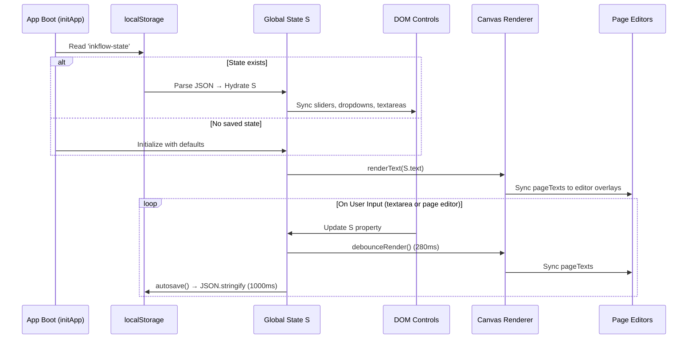

# 💾 State Management & Hydration

This document describes Inkflow's global state schema, the hydration/persistence lifecycle, and the debounced autosave mechanism.

---

## System Configuration Schema (`S`)

The system state is governed by a central global configuration object `S` that acts as the single source of truth for the entire runtime environment.

| Property Name | Data Type | Default Value | Description / Constraint |
| :--- | :--- | :--- | :--- |
| `text` | `String` | `""` | The active text content entered in the textarea or generated by AI. |
| `font` | `String` | `"Caveat"` | The name of the rendering font family (system, Google Fonts, or custom). |
| `fontSize` | `Integer` | `16` | Size in pixels ($14\text{px}$ to $52\text{px}$ range). |
| `lineHeight` | `Float` | `1.5` | Vertical line spacing ratio ($1.2$ to $3.0$ range). |
| `wordSpacing` | `Integer` | `1` | Horizontal extra padding between words ($-2\text{px}$ to $14\text{px}$ range). |
| `margin` | `Integer` | `80` | Canvas boundary padding margins ($20\text{px}$ to $100\text{px}$ range). |
| `rotationMax` | `Float` | `1` | Maximum character tilt angle in degrees ($0°$ to $12°$ range). |
| `inkColor` | `String` | `"#1c2340"` | Hexadecimal string representation of the active ink color. |
| `bleed` | `Float` | `0.5` | Intensity multiplier for drop-shadow bleeds ($0.0$ to $2.5$ range). |
| `pressure` | `Float` | `0.12` | Scale of stroke thickness variation ($0.0$ to $0.3$ range). |
| `paperStyle` | `String` | `"ruled"` | Page pattern identifier (`ruled`, `plain`, `grid`, `legal`, `vintage`, `dark`). |
| `animSpeed` | `Integer` | `8` | Characters written per animation frame ($1$ to $30$ range). |
| `currentPage`| `Integer` | `0` | 0-indexed integer identifying the active viewport page in focus. |
| `draftedGlyphs`| `Object` | `{}` | Dictionary storing user-drawn SVG path coordinates for custom handwriting. |

> **v1.2.0 Note**: Default values for `fontSize`, `lineHeight`, `wordSpacing`, `margin`, and `rotationMax` have been tuned down for cleaner, more realistic handwriting output at standard sizes.

---

## The Hydration & Persistence Loop



### Step-by-Step Lifecycle

1. **App Boot (`initApp`)**: Reads state from `localStorage` key `inkflow-state`, sets up file upload module, and initializes HandFonted studio.
2. **Deserialization**: If found, values are parsed and hydrated into `S`. Corresponding input sliders, dropdowns, and text fields are programmatically updated.
3. **Trigger Render**: Calls `renderText()` using the restored settings. If no state exists, creates an empty canvas with ruled guides and a watermark placeholder.
4. **Editor Sync**: After rendering, each page editor overlay receives the corresponding `pageTexts[i]` content and has its styles updated via `updateEditorStyles()`.
5. **Change Event Listener**: Any interaction with input elements triggers a debounced `autosave()` cycle that serializes `S` into JSON and caches it in `localStorage` after a 1000ms delay.

---

## Dual Input Paths

Inkflow accepts text input from two synchronized sources:

### Sidebar Textarea (`#text-input`)
Traditional textarea input on the left panel. Changes are debounced and trigger `renderText()`.

### Inline Page Editors (`.page-editor`)
Each canvas page has a transparent `contenteditable` overlay. On input:
1. `getGlobalTextFromEditors()` reads all editors and concatenates text
2. The result is synced back to `S.text` and the sidebar textarea
3. `autosave()` is called to persist the change

On focus, the editor text becomes visible (ink color) and the canvas text is hidden. On blur, the editor text becomes transparent and the canvas re-renders the handwriting.

---

## Autosave Implementation

```javascript
let autosaveTimeout;
function autosave() {
  clearTimeout(autosaveTimeout);
  autosaveTimeout = setTimeout(() => {
    const state = {
      text: document.getElementById('text-input').value,
      font: S.font, fontSize: S.fontSize, lineHeight: S.lineHeight,
      wordSpacing: S.wordSpacing, margin: S.margin, rotationMax: S.rotationMax,
      inkColor: S.inkColor, bleed: S.bleed, pressure: S.pressure,
      paperStyle: S.paperStyle, draftedGlyphs: draftedGlyphs,
    };
    localStorage.setItem('inkflow-state', JSON.stringify(state));
  }, 1000);
}
```

---

## Reset to Defaults

The `resetToDefaults()` function restores all settings to factory values, updates all DOM controls (sliders, dropdowns, color pickers, paper buttons), and triggers a re-render with autosave.
