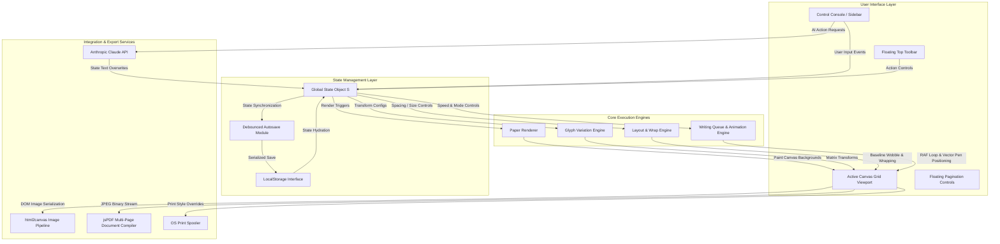

# 🏛️ System Architecture

This document outlines the **high-level system architecture**, **component layers**, and **data flow** of the Inkflow Handwritten Notes Generator.

---

## Architecture Overview

Inkflow is architected as a highly modular, decoupled, single-file client-side application. It operates entirely within the user's browser, eliminating backend latency and optimizing rendering speeds.

---

## Component Map

The application's structural components are divided into four primary layers:

---

## Layer Descriptions

### 1. User Interface Layer
The visible DOM elements the user interacts with directly. These include the sidebar control console (300px width), the floating top toolbar (56px fixed header), the main canvas grid viewport, and the pagination controls at the bottom.

### 2. State Management Layer
A centralized global configuration object `S` acts as the single source of truth. Changes to any UI control update `S`, which triggers re-rendering. A debounced autosave module serializes the state to `localStorage` after a 1000ms idle delay.

### 3. Core Execution Engines
The rendering pipeline that transforms state data into visual canvas output. This includes the paper background painter, the per-character glyph variation engine, the word-wrap and page-break layout engine, and the live writing animation system.

### 4. Integration & Export Services
External integrations for AI text generation (Anthropic Claude), image screenshot capture (html2canvas), multi-page PDF compilation (jsPDF), and native OS print dialog access.

---

## Key Architectural Strengths

1. **Perfect Decoupling**: The central config state `S` is completely decoupled from the rendering loop. Updates to inputs, themes, or text simply update `S` and trigger a canvas repaint.
2. **Robust Multi-Page Math**: The word-wrapping and page-breaking calculations run automatically during rendering, ensuring clean margins without splitting words across lines or pages.
3. **Pristine Client-Side Vectorization**: Performs real-time Moore-Neighbor contour tracing, RDP curve simplification, and TTF compilation purely inside the browser.
4. **No-Lag Rendering**: The debounced rendering pipeline prevents UI stutters, keeping inputs responsive even when editing long-form text.
5. **Standalone Portability**: All styling, layout logic, rendering scripts, and third-party dependencies run inside a single, portable HTML file that works offline in any browser.
