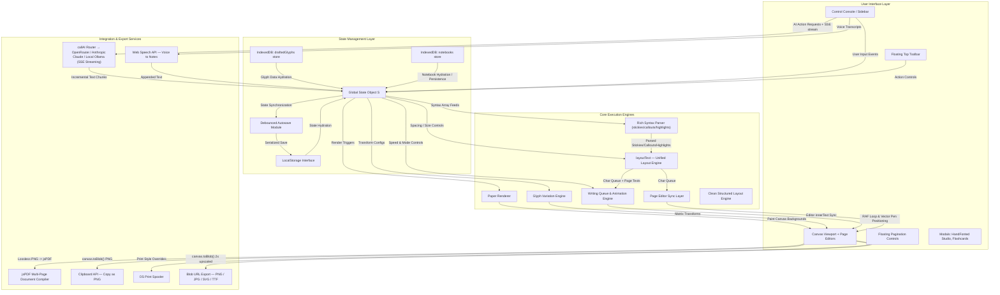
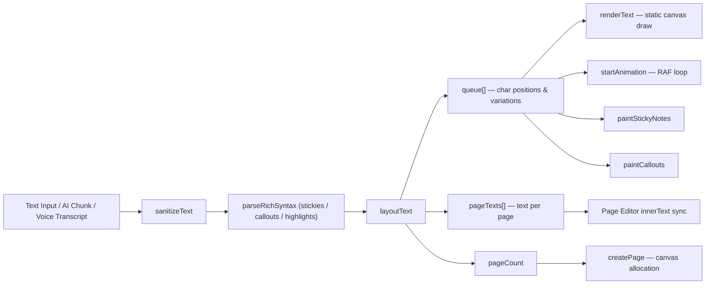

  

# 🏛️ System Architecture

This document outlines the **high-level system architecture**, **component layers**, and **data flow** of the Inkflow Handwritten Notes Generator.

---

## Architecture Overview

Inkflow is architected as a modular, decoupled, single-file client-side application. It operates entirely within the user's browser, eliminating backend latency and optimizing rendering speeds. All application logic lives in `index.js` (≈5,600 lines), styling in `index.css`, and structure in `index.html`.

---

## Component Map

The application's structural components are divided into four primary layers:

```mermaid
graph TD
    subgraph UI_Layer ["User Interface Layer"]
        A["Control Console / Sidebar"]
        B["Floating Top Toolbar"]
        C["Canvas Viewport + Page Editors"]
        D["Floating Pagination Controls"]
        T["Modals: HandFonted Studio, Flashcards"]
    end

    subgraph State_Layer ["State Management Layer"]
        E["Global State Object S"]
        F["Debounced Autosave Module"]
        G["LocalStorage Interface"]
        R["IndexedDB: draftedGlyphs store"]
        N["IndexedDB: notebooks store"]
    end

    subgraph Engine_Layer ["Core Execution Engines"]
        H["Paper Renderer"]
        I["Glyph Variation Engine"]
        J["layoutText — Unified Layout Engine"]
        K["Writing Queue & Animation Engine"]
        L["Page Editor Sync Layer"]
        U["Rich Syntax Parser (stickies/callouts/highlights)"]
        V["Clean Structured Layout Engine"]
    end

    subgraph External_Layer ["Integration & Export Services"]
        M["callAI Router → OpenRouter / Anthropic Claude / Local Ollama (SSE Streaming)"]
        O["jsPDF Multi-Page Document Compiler"]
        P["Clipboard API — Copy as PNG"]
        Q["OS Print Spooler"]
        W["Web Speech API — Voice to Notes"]
        X["Blob URL Export — PNG / JPG / SVG / TTF"]
    end

    A -->|"User Input Events"| E
    B -->|"Action Controls"| E
    E -->|"State Synchronization"| F
    F -->|"Serialized Save"| G
    G -->|"State Hydration"| E
    R -->|"Glyph Data Hydration"| E
    N -->|"Notebook Hydration / Persistence"| E

    E -->|"Render Triggers"| H
    E -->|"Transform Configs"| I
    E -->|"Spacing / Size Controls"| J
    E -->|"Speed & Mode Controls"| K
    E -->|"Syntax Array Feeds"| U
    U -->|"Parsed Stickies/Callouts/Highlights"| J

    H -->|"Paint Canvas Backgrounds"| C
    I -->|"Matrix Transforms"| C
    J -->|"Char Queue + Page Texts"| K
    J -->|"Char Queue"| L
    K -->|"RAF Loop & Vector Pen Positioning"| C
    L -->|"Editor innerText Sync"| C

    A -->|"AI Action Requests + SSE stream"| M
    M -->|"Incremental Text Chunks"| E
    A -->|"Voice Transcripts"| W
    W -->|"Appended Text"| E
    C -->|"canvas.toBlob() 2x upscaled"| X
    C -->|"Lossless PNG -> jsPDF"| O
    C -->|"canvas.toBlob() PNG"| P
    C -->|"Print Style Overrides"| Q
```

---

## Layer Descriptions

### 1. User Interface Layer
The visible DOM elements the user interacts with directly: the sidebar control console, the floating top toolbar (56px fixed header), the main canvas grid viewport with inline page editors (`.page-editor` contenteditable overlays), bottom pill-style pagination controls, and the modal overlays (HandFonted Studio, Flashcards review).

### 2. State Management Layer
A centralized global configuration object `S` acts as the single source of truth. Changes to any UI control update `S`, which triggers a debounced re-render. A debounced autosave module serializes settings to `localStorage` after a 1000ms idle delay and mirrors them into the active notebook. Custom handwriting glyphs live in **IndexedDB** (`InkflowDB` → `draftedGlyphs`), and notebooks live in **IndexedDB** (`InkflowDB` → `notebooks`), bypassing the 5MB `localStorage` quota.

### 3. Core Execution Engines
The rendering pipeline that transforms state into visual canvas output. The key innovation since v1.2.0 is the **unified `layoutText()` engine**, which performs all word-wrap, page-break, and character-queue computation in a single pass. It routes to three specialist engines — `layoutTextTwoColumn`, `layoutTextCornell`, and `layoutTextCleanStandard` — while the standard flowing engine handles the default case. Static rendering (`renderText`) and animation (`startAnimation`) consume the identical layout output.

### 4. Integration & Export Services
External integrations for AI text generation via the `callAI()` provider router (OpenRouter + Anthropic + local Ollama, SSE streaming), voice dictation (Web Speech API), native canvas image exports (2×-upscaled Blob-URL PNG/JPG/SVG), multi-page lossless PDF compilation (jsPDF), clipboard copy (Clipboard API), and native OS print dialog access. User-provided content (notebook titles, folder names) is escaped via `escapeHtml()` before innerHTML injection to prevent XSS.

---

## Rendering Pipeline Data Flow

```mermaid
graph LR
    INPUT["Text Input / AI Chunk / Voice Transcript"] --> SANITIZE["sanitizeText"]
    SANITIZE --> RICH["parseRichSyntax (stickies / callouts / highlights)"]
    RICH --> LAYOUT["layoutText"]
    LAYOUT --> QUEUE["queue[] — char positions & variations"]
    LAYOUT --> PAGETEXTS["pageTexts[] — text per page"]
    LAYOUT --> PAGECOUNT["pageCount"]

    QUEUE --> STATIC["renderText — static canvas draw"]
    QUEUE --> ANIM["startAnimation — RAF loop"]
    QUEUE --> STICKY["paintStickyNotes"]
    QUEUE --> CALLOUT["paintCallouts"]
    PAGETEXTS --> EDITORS["Page Editor innerText sync"]
    PAGECOUNT --> PAGES["createPage — canvas allocation"]
```

---

## Key Architectural Strengths

1. **Unified Layout Engine**: A single `layoutText()` function handles all word-wrap, page-break, and character coordinate calculations — ensuring layout parity between static renders and animations.
2. **Perfect Decoupling**: The central config state `S` is decoupled from the rendering loop. Updates to inputs, themes, or text simply update `S` and trigger a canvas repaint.
3. **SSE Streaming AI**: AI responses stream word-by-word into the canvas in real time, preventing UI freezing.
4. **High-Resolution Exports**: Every image/PDF export runs through `_upscaleCanvas()` for a 2× boost (~150 DPI), with lossless PNG encoding for PDF.
5. **Inline Page Editing**: Transparent `contenteditable` overlays over each canvas allow direct text editing, with automatic sync back to the global text state.
6. **Rich Study Syntax**: `[sticky]`, `[callout]`, `==highlight==`, and `Q:`/`A:` markers are parsed out of the plain text and painted as margin notes, boxes, and flashcards.
7. **Client-Side Vectorization**: Real-time Moore-Neighbor contour tracing, RDP curve simplification, and TTF compilation run purely inside the browser.
8. **Standalone Portability**: All styling, layout logic, rendering scripts, and third-party dependencies run from a single, portable HTML file.
