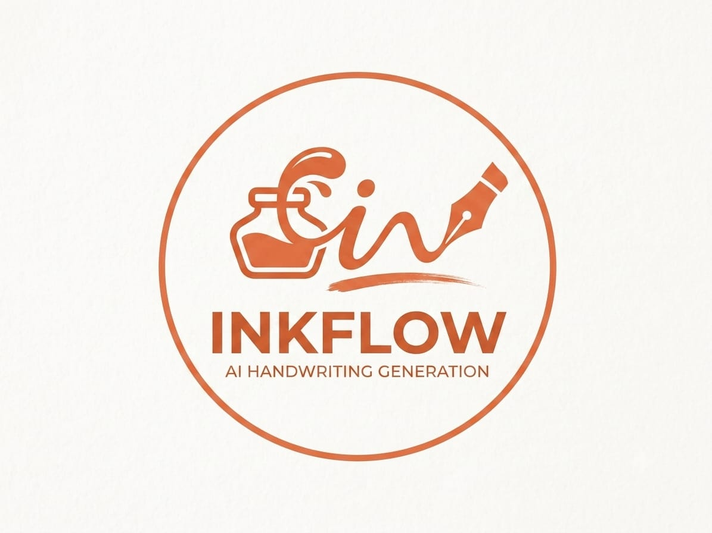

<p align="center">
  
</p>

# 🖱️ UX Interactions & User Flows

This document maps the user-facing interactions in Inkflow to the functions and flows behind them.

---

## Primary Workflow

```
Type / paste / drop text → ✦ Render (instant) or ▶ Animate (handwriting)
    → edit inline on the canvas pages → export
```

### Text Input & Drop Zones
The sidebar text area accepts typing, pasting, and drag-and-drop of `.txt`, `.md`, and `.pdf` files. A separate file-upload wrapper handles the same via the file picker. PDFs are parsed with the lazily-loaded pdf.js library.

### Render vs Animate
| Button | Function | Behavior |
| :--- | :--- | :--- |
| ✦ Render | `triggerRender()` | Instantly draws the full text without animation |
| ▶ Animate | `startAnimation()` | Plays the handwriting animation, then finalizes |
| ■ Stop | `stopAnimation()` | Freezes animation mid-write |
| ✕ (text area) | `clearText()` | Wipes the text area and canvas |
| ✕ (toolbar) | `clearText()` | Same — toolbar clear button |

### Inline Editing (Page Editor)
Each A4 canvas carries a transparent `contenteditable` overlay. Click any page and type directly — edits sync back through `getGlobalTextFromEditors()` on blur and trigger a debounced re-render (280ms). The editor mirrors the canvas font, size, and alignment, so WYSIWYG stays intact.

### Page Navigation
The floating pill at the bottom shows `Page X of Y` with ◀ / ▶ buttons (`navigatePage(-1)` / `navigatePage(1)`). Page 1 hides the prev button; the last page hides next.

---

## Study Workflows

### Study Mode
### Study Mode
The 📖 **Study Mode** toolbar button (`toggleStudyMode()`) adds the `study-mode-active` class to the body. This expands the canvas viewport to 100% width (`grid-template-columns: 1fr`), hides the sidebar (`display: none`), auto-dims the top toolbar (`opacity: 0.5`) with hover reveal, smoothly centers the active page canvas into view, and reveals the floating **🚪 Exit Study Mode** button (bottom-right). Pressing `Escape` or clicking the floating button exits Study Mode.

### Flashcards
1. Type study syntax — e.g. `Q: What is inertia?` followed by `A: Resistance to motion` — see [Handwriting Engine](./handwriting-engine.md#pre-processing-rich-study-syntax).
2. The 🃏 **Flashcards** toolbar button appears with a live count (`flashcard-count-indicator`).
3. Click it to open the review modal (`openFlashcardsModal()`): click the card to flip (`flipFlashcard()`), navigate with **◀ Prev / Next ▶** (`prevFlashcard()` / `nextFlashcard()`), and track progress via the "remaining" badge.
4. Close with ✕.

### Voice to Notes
The 🎤 mic button (`toggleVoiceInput()`) uses the Web Speech API (`webkitSpeechRecognition`, continuous, `en-US`). Transcripts append directly into the text area; the button lights up while recording. Permission denials or speech errors trigger user-friendly toast notifications (`showToast(msg, 'error')`); if the API is unsupported, the mic button is disabled (`initVoiceToNotes()`).

### Notebooks & Folders
The sidebar **Notebooks** section is an IndexedDB-backed explorer:
- **＋ New Note** (`createNewNotebook()`) — prompts for a title/folder, saves, and loads the new note
- **＋ Folder** (`createNewFolder()`) — creates a folder with an untitled note inside
- Clicking a note (`loadNotebook(id)`) restores its text + per-note settings (paper, ink, font, etc.)
- Clicking a note's 🗑 (`deleteNotebookClicked(id, event)`) confirms, deletes, and loads the next note (or clears)

Changes are mirrored live into the active notebook on every `autosave()`.

---

## Typography Interactions

### Font & Size
The font family dropdown re-renders immediately. **Auto-Fit** (`autoFitFontSize()`) binary-searches the largest size in 14–52px that keeps your text on one page, then re-renders. The size slider (12–56) and line-height/word-spacing/margin sliders all live-render.

### Text Alignment
Three alignment buttons (**Upper**, **Middle**, **Lower**) call `setTextAlignment('top'|'middle'|'bottom')`; the active one carries the `.active` class. Vertical placement relative to notebook lines is computed by `getAlignmentOffset()` (Lower sits text baseline on rule line, Middle centers text between lines, Upper positions text touching the upper line) across all layout modes including Clean Notes. Preview icons accurately reflect baseline placement.

### Reset Defaults
**↺ Reset Defaults** (`resetToDefaults()`) restores factory settings and re-syncs every control.

---

## Paper & Ink

- The 10 paper buttons (`setPaper(this)`) switch paper style and re-render; **Clean Notes** enforces a non-handwriting font list.
- The **Header** checkbox toggles the Date / P. No. worksheet header (`S.showHeaderBox`); the inputs on each page can be edited directly and re-render via `redrawPageCanvas()`.
- Ink presets (🔵⚫💙🟣🔴🟢) call `setInkPreset(hex, name)`; the custom color picker sets any color. Bleed and pressure sliders tune the writing effect.

### Theme Packs
The **One-click Note Themes** swatch grid calls `applyTheme(themeId)` (Default / Vintage / Cute / Science / Minimal / Scrapbook), which reconfigures paper + ink + rotation + font size together.

---

## AI Workflows

Five AI buttons (`aiAction(type)`) stream results onto the canvas via the `callAI()` provider router:
- 🪄 **Smart Arrange** — restructures messy notes
- 📋 **Summarize Notes** — condensed summary
- ✏️ **Improve Grammar** — cleaned-up prose
- 🎓 **Lecture → Notes** — transcript → study notes
- 📝 **Generate Assignment** — creates an assignment sheet

Configure provider (OpenRouter / Anthropic / Ollama), model, and API key in the **AI Features** section; a status line (`setAiStatus`) shows progress. All actions route through `callAI()` which dispatches to the correct backend. See [AI Integration](./ai-integration.md).

---

## Export Interactions

| Action | Button | Result |
| :--- | :--- | :--- |
| PNG | 🖼 | 2×-upscaled PNGs — `inkflow-notes.png` (single page) or `inkflow-notes-pageN.png` (multi-page) |
| JPG | 📷 | Same naming, 2× JPEGs (quality 0.97) |
| PDF | 📄 | Single lossless multi-page PDF (`inkflow-notes.pdf`) |
| SVG | 🎨 | `inkflow-notes.svg` / `inkflow-notes-pageN.svg`, wrapping the PNG |
| Copy | 📋 | Current page copied to the clipboard as PNG |
| Print | 🖨 | `window.print()` with print CSS |

Successful exports show a green toast; failures show a warning/error toast (`showExportToast`). See [Export Pipelines](./export-pipelines.md).

---

## Custom Font Studio (HandFonted)

Opened via **🎨 HandFonted Studio**:

1. **Live Sketchpad tab** — pick a character from the grid (52 letters + 32 symbols), draw it with the mouse/pen, then **💾 Save Character** (`saveActiveCharacter()`). Undo, clear, and brush-size controls are inline. Progress (X / 84) tracks completion.
2. **Upload Template tab** — download the **📦 3-sheet Template Package**, print it, write your characters, photograph/scan, upload, and auto-trace each cell into vector paths.
3. **💾 Save Progress / 📂 Load Progress** export/import the whole project as JSON.
4. **🔨 Build Font** (`buildCustomFont()`) compiles glyphs into a TrueType font, registers it with `FontFace`, and applies it instantly.

See [Custom Font Suite](./custom-font-suite.md).

---

## Keyboard & Accessibility Hooks

- All interactive buttons are real `<button>` elements; export, dark-mode, and hamburger controls carry `aria-label`/`title` attributes.
- The dark-mode toggle (`applyDark()`) flips the `html.dark` class; the header's ☀/🌙 icon reflects state.
- See [Accessibility](./accessibility.md) for the full report.
